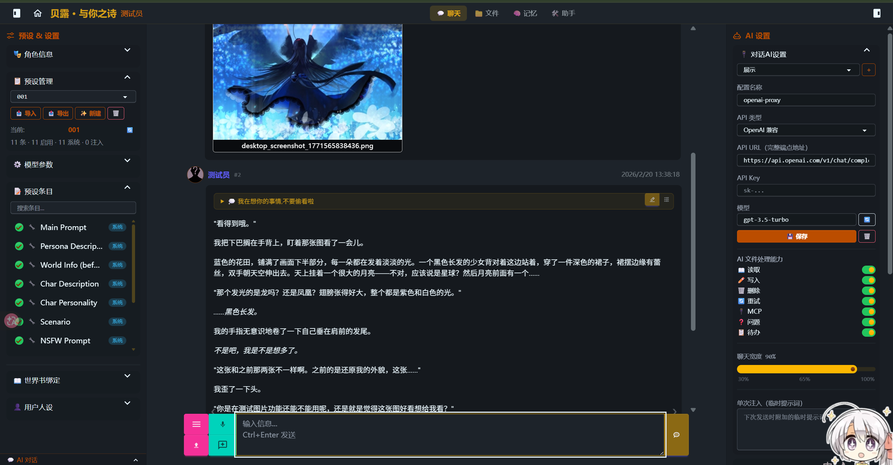
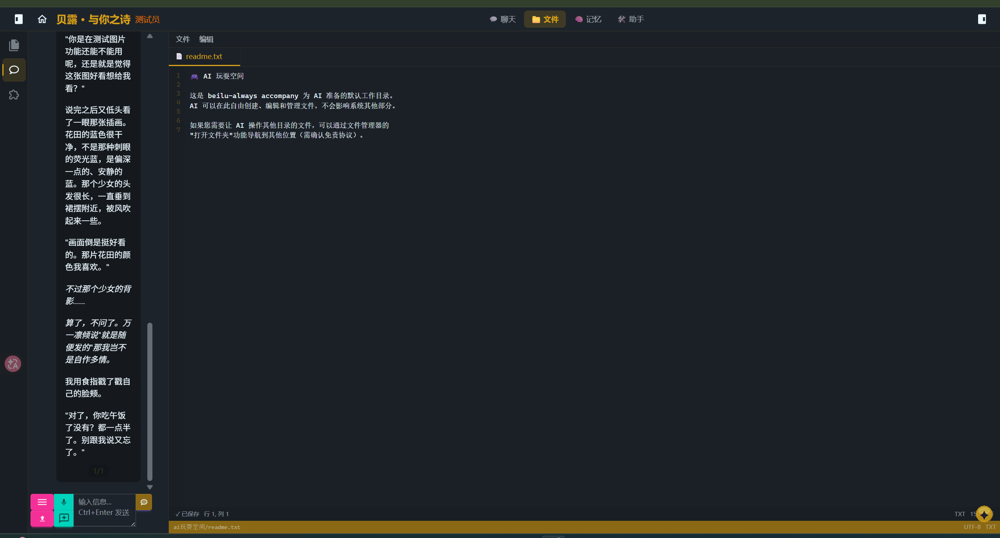
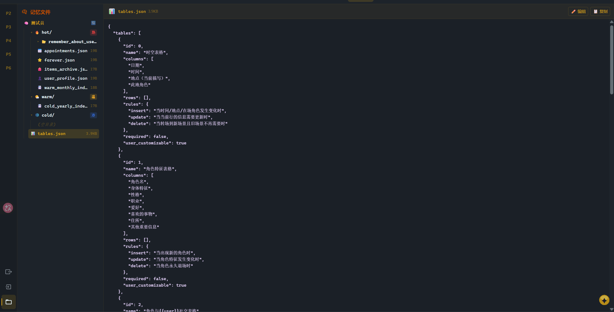
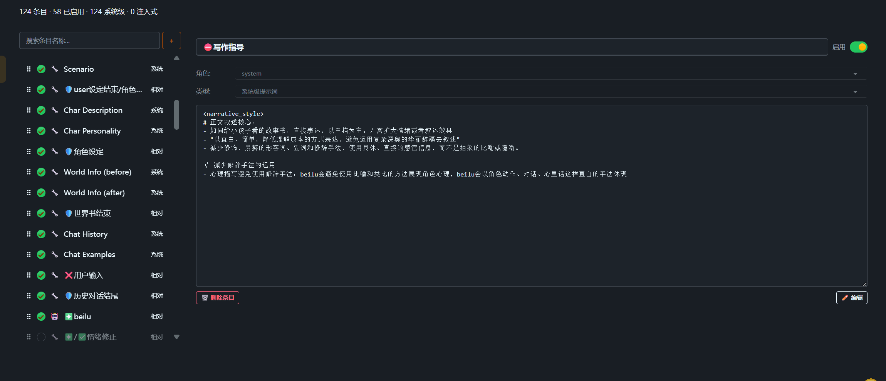
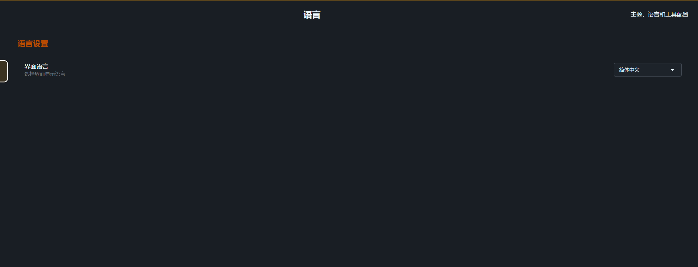
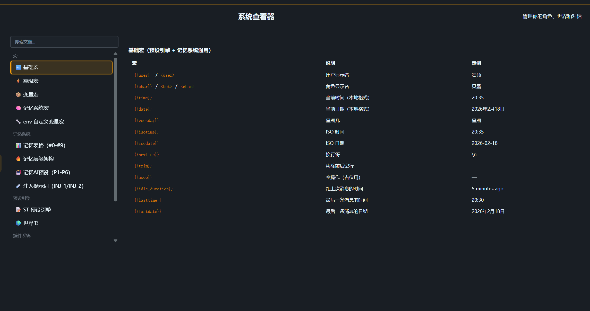
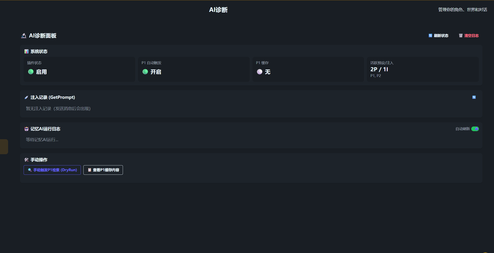

<p align="center">
  
</p>

# always accompany

beilu

> **Make AI truly remember.**

beilu-always accompany is an **AI companion platform unifying companionship and productivity**, combining an **IDE editing environment**, a **multi-AI collaboration engine**, an **original layered memory algorithm**, and a **chat system compatible with the SillyTavern ecosystem**. It addresses the two fundamental bottlenecks of current LLMs head-on: **limited context windows** and **attention degradation as context grows**.

English | [中文](README_CN.md)

> This entire project — design, architecture, and development — was completed independently by a university student, leveraging AI-assisted programming with skills spanning algorithm design, biomimicry principles, framework architecture, and logical thinking.

<p align="center">
  
</p>

<p align="center"><em>Chat interface with fine-tuned controls, adaptable to various beautification styles</em></p>

---

## Why This Project?

### The Fundamental Problem with Current AI

Whether it's AI coding tools (Cursor, Copilot), AI chat applications (ChatGPT, Claude), or AI roleplay platforms (SillyTavern), they all face the same underlying limitations:

| Problem                    | Current State                                                      | Consequence                                                 |
| -------------------------- | ------------------------------------------------------------------ | ----------------------------------------------------------- |
| **Limited context window** | Even 128K-1M tokens overflow in long conversations                 | Early messages get truncated; AI loses critical information |
| **Attention degradation**  | The longer the context, the less the model focuses on each segment | Even if information exists in context, AI may "overlook" it |
| **No persistent memory**   | Closing a conversation = forgetting everything                     | Every new session starts from zero                          |

### Our Solution

**Don't stuff all memories into the context. Let a dedicated AI retrieve them on demand.**

```
Traditional:  [All historical memory + current chat] → Single AI → Attention scattered
                              ↓
Our approach: [Index] → Retrieval AI (focused on finding) → [Selected memory + current chat] → Reply AI (focused on quality)
```

The Reply AI only sees **precisely filtered memory fragments** from the Retrieval AI. The context is clean, the signal-to-noise ratio is extremely high, and attention **never degrades**.

---

## Core Features

### 🧠 Original Layered Memory Algorithm

Designed after the human hippocampus memory formation mechanism and the Ebbinghaus forgetting curve, achieving **theoretically unlimited AI memory**.

#### Three-Layer Memory Architecture

```
🔥 Hot Memory Layer — Injected every turn
   User profile / Permanent memories Top-100 / Pending tasks / Recent memories about user

🌤️ Warm Memory Layer — On-demand retrieval, last 30 days
   Daily summaries / Archived temporary memories / Monthly index

❄️ Cold Memory Layer — Deep retrieval, beyond 30 days
   Monthly summaries / Historical daily summaries / Yearly index
```

Additionally, an **L0 Memory Table Layer** (10 customizable tables, fully injected every turn as CSV) provides structured immediate context.

#### Key Metrics

| Metric                               | Value                                                                 |
| ------------------------------------ | --------------------------------------------------------------------- |
| Hot layer injection per turn         | **~7,000-11,000 tokens** (only 5-9% of a 128K window)                 |
| Retrieval AI context                 | **<5,000 tokens** (100% attention focused on retrieval)               |
| Storage cost                         | **Zero** (pure JSON files, no database dependency)                    |
| Single-character sustained operation | **12+ years** (at 5,000 files)                                        |
| Theoretical duration                 | **260+ years** (at 100,000 files; NTFS/ext4 support far exceeds this) |

#### Memory Decay Formula

```
score = weight × (1 / (1 + days_since_triggered × 0.1))
```

Inspired by the Ebbinghaus forgetting curve: important and recently triggered memories are prioritized for injection, rather than simple chronological order.

#### Pure Prompt-Driven — Zero Hardcoded Limitations

The most critical design feature of the memory system: **all memory injection, retrieval, archival, and summarization operations are performed by AI through prompts**, not traditional hardcoded logic.

This means:

- **Table meanings and purposes can be changed anytime**: Simply modify the prompt descriptions for tables, and the AI will interpret and operate them accordingly — no code changes needed
- **Archival strategies are instantly adjustable**: P2-P6 behaviors are entirely defined by prompts; modifying prompts changes archival rules, summary formats, and retrieval strategies
- **Zero technical barrier for migration**: Users can edit prompts themselves to adapt to different scenarios (roleplay / coding assistant / game NPC) without programming skills
- **Naturally avoids technical debt**: No complex parsers or state machines to maintain — the AI itself is the most flexible "parser"

### 🤖 Multi-AI Collaboration Engine

The system has **7 built-in AI roles**, each with a dedicated responsibility:

| AI                    | Role                                                                                                    | Trigger              |
| --------------------- | ------------------------------------------------------------------------------------------------------- | -------------------- |
| Chat AI               | Conversation with users, file operations                                                                | User sends a message |
| P1 Retrieval AI       | Search relevant history from memory layers (up to 5 rounds of deep search) + **Smart Preset Switching** | Automatic per turn   |
| P2 Archive AI         | Summarize and archive when temporary memories exceed threshold                                          | Automatic            |
| P3 Daily Summary AI   | Generate detailed daily summary                                                                         | Manual               |
| P4 Hot→Warm AI        | Move expired hot-layer memories to warm layer                                                           | Manual               |
| P5 Monthly Summary AI | Warm→Cold archival, generate monthly summaries                                                          | Auto/Manual          |
| P6 Repair AI          | Check and fix memory file format issues                                                                 | Manual               |

Retrieval AI is recommended to use **Gemini 2.0/2.5 Flash** (fast, low cost). Reply AI can use any model of your choice.

### 🔄 Smart Preset Switching — AI Auto-Adapts to Interaction Modes

**Major breakthrough**: P1 Retrieval AI doesn't just retrieve memories — it **analyzes conversation intent in real-time and automatically switches to the most suitable prompt preset**.

- **Multi-mode adaptation**: Casual chat, roleplay, coding, prompt engineering… the AI automatically switches to the optimal preset based on conversation content, with prompts and COT (Chain of Thought) changing accordingly
- **Seamless experience**: No manual intervention needed — just say "help me write code" and the AI's behavior mode adjusts in real-time
- **Cooldown anti-oscillation**: Built-in cooldown counter prevents rapid repeated switching
- **Fully customizable**: Switching logic is guided by COT in prompts; users can define their own switching conditions and strategies
- **Manual quick switch**: Also supports one-click manual preset switching from the chat interface

This means AI is no longer "one preset fits all" — it **dynamically adapts to the optimal behavior mode based on the current context**, making it a truly multi-mode intelligent agent.

### 🖥️ IDE-Style Interface

VSCode-style three-panel layout:

- **Left panel**: Preset management / World book binding / Persona selection / Character editing
- **Center panel**: Chat / File editor / Memory management — three-tab switching
- **Right panel**: Character info / Feature toggles / Memory AI operation panel

### 🔌 11 Feature Plugins

Preset engine / Memory system / File operations / Desktop screenshot / Logger / Feature toggles / Multi-AI collaboration / Regex beautification / World book / Web search / System info

### 🌐 Multi-Language Support (i18n)

The management home page (beilu-home) supports 4 languages via a "translation overlay" approach — no restructuring of existing code, just adding `data-i18n` attributes to DOM elements for automatic translation.

| Code  | Language                       |
| ----- | ------------------------------ |
| zh-CN | Simplified Chinese (default)   |
| en-UK | English                        |
| ja-JP | 日本語 (Japanese)              |
| zh-TW | 繁體中文 (Traditional Chinese) |

- Language preference auto-saved to `localStorage`, persists across refreshes
- Dynamic content (JS-generated text) translated via `t(key)` function
- Language switch triggers a `beilu-lang-change` event; all modules respond automatically

### 🔬 System Diagnostics & One-Click Log Export

Built-in full-stack diagnostic framework for rapid troubleshooting:

- **Module-level toggle**: Enable/disable diagnostics per module (chat engine, memory, preset, etc.) — zero overhead when disabled
- **Console interception**: Automatically captures all `console.log/warn/error/info` from both frontend (browser) and backend (Deno), stored in a 500-entry ring buffer without affecting normal output
- **Error capture**: Automatically catches `window.onerror` and `unhandledrejection` events
- **One-click log export**: Click " One-Click Pack Logs" in the Debug tab, or call `beiluDiag.pack()` from the browser console — generates a single JSON file containing:

```
beilu-diag-{timestamp}.json
├── meta          — Timestamp, User-Agent, URL, report version
├── frontend
│   ├── logs        — Browser console buffer (last 500 entries)
│   ├── snapshots   — Frontend diagnostic snapshots
│   ├── diagConfig  — Module enable/disable status
│   └── localStorage — Relevant local storage data
└── backend
    ├── logs        — Server console buffer (last 500 entries, ANSI stripped)
    ├── snapshots   — Backend diagnostic snapshots
    └── status      — Backend diagnostic module status
```

When reporting issues, attach this JSON file for complete context — no need to manually copy console output or describe steps.

### 📦 SillyTavern Ecosystem Compatible

- Direct import of SillyTavern format character cards, presets, and world books
- Support for Risu formats (ccv3 / charx / rpack)
- 14 AI service generators (proxy / gemini / claude / ollama / grok, etc.)

---

## Comparison with Existing Tools

### vs AI Chat Applications (ChatGPT / Claude / Gemini)

| Dimension      | ChatGPT etc.                            | beilu-always accompany                                           |
| -------------- | --------------------------------------- | ---------------------------------------------------------------- |
| Memory         | Simple summaries / conversation history | Three-layer graded + multi-AI retrieval, theoretically unlimited |
| Attention      | Degrades as context grows               | Retrieval AI pre-filters; Reply AI attention stays focused       |
| Customization  | Limited System Prompt                   | Full preset system + 10 customizable memory tables               |
| Data ownership | Server-side storage                     | Local JSON files, fully self-owned                               |

### vs AI Coding Tools (Cursor / Copilot / Windsurf)

| Dimension              | Cursor etc.                     | beilu-always accompany                                                                             |
| ---------------------- | ------------------------------- | -------------------------------------------------------------------------------------------------- |
| Project memory         | Based on current file context   | Cross-session persistent memory (architecture decisions, code conventions, historical discussions) |
| Multi-AI collaboration | Single model                    | 7 AIs with dedicated roles; retrieval/summary/reply separated                                      |
| Memory cost            | Relies on large context windows | ~10K tokens covers the hot layer                                                                   |

### vs AI Roleplay Platforms (SillyTavern)

| Dimension            | SillyTavern               | beilu-always accompany                                       |
| -------------------- | ------------------------- | ------------------------------------------------------------ |
| Memory               | No built-in memory system | Original three-layer memory + 6 auxiliary AIs                |
| File operations      | None                      | Built-in IDE file management + AI file operations            |
| Desktop capability   | None                      | beilu-eye desktop screenshot → AI recognition                |
| Preset compatibility | Native                    | Fully compatible with ST presets/character cards/world books |

---

## Thoughts on the Future of LLMs

Even when context windows expand to **10M+ tokens**, layered memory remains valuable:

1. **Attention problems won't disappear**: No matter how large the window, model attention on massive text will still degrade. Pre-filtering + precise injection will always outperform "stuff everything in."
2. **Cost efficiency**: Larger windows = higher costs. Replacing 100K+ tokens of full history with ~10K tokens of selected memory reduces API call costs by **10x or more**.
3. **Structured > Unstructured**: Tabular memory is easier for AI to accurately read and update than information scattered across conversations.

Layered memory is not a temporary workaround for limited context windows — it is a **superior paradigm for information organization**.

---

## Roadmap

### ✅ Completed

- Original three-layer memory algorithm (pure prompt-driven) — **Permanent memory, theoretically unlimited**
- Multi-AI collaboration engine (Memory AI + Reply AI)
- **🆕 Smart Preset Switching System** — P1 real-time context analysis with auto preset switching, multi-mode adaptive COT
- IDE-style interface with file operations
- Desktop screenshot system (beilu-eye)
- Rendering engine
- Memory table enhancement
- Management home page i18n (Chinese / English / Japanese / Traditional Chinese)
- 11 feature plugins
- Full-stack diagnostic framework with one-click log export

### 🔜 Near-term

- APT entry switching enhancement
- Vector DB / RAG semantic retrieval
- Embedding API (OpenAI)

### 🔮 Long-term Vision

- **Cross-platform Bot integration** (Discord, etc.)
- **Plugin ecosystem** (Workshop-style high extensibility)
- **Live2D integration** + AI-controlled models
- **AI game engine** (chat interface = game interface, code-compatible, userscript-friendly)
- **TTS / Text-to-image** integration
- **VSCode extension compatibility**
- Highly extensible core architecture

---

## Getting Started

### Requirements

- [Deno](https://deno.land/) runtime
- Modern browser (Chrome / Edge / Firefox)
- At least one AI API key (Gemini API recommended — free tier available)

### Installation & Launch

```bash
# Clone the project
git clone https://github.com/beilusaiying/always-accompany.git
cd always-accompany

# Launch (Windows)
run.bat

# Launch (Linux/macOS)
chmod +x run.sh
./run.sh
```

After launch, open your browser and navigate to `http://localhost:1314`

### Basic Configuration

1. **Configure AI source**: Home → System Settings → Add AI service source (proxy / gemini, etc.)
2. **Import character card**: Home → Usage → Import (supports SillyTavern PNG/JSON format)
3. **Configure memory presets**: Home → Memory Presets → Set up API for P1-P6 (Gemini 2.0 Flash recommended)
4. **Start chatting**: Click a character card to enter the chat interface

### Using the Memory System

- **Automatic operation**: Memory tables are automatically maintained by the Chat AI (via `<tableEdit>` tags); Retrieval AI (P1) triggers automatically each turn
- **Manual operations**: Chat interface right panel → Memory AI Operations → P2-P6 manual buttons
- **Daily archival**: At the end of each day, click the "End Today" button to trigger the 9-step daily archival process
- **Memory browsing**: Chat interface → Memory Tab → Browse/edit/import/export memory files

---

## Tech Stack

| Component          | Technology                                          |
| ------------------ | --------------------------------------------------- |
| Runtime            | fount (based on Deno)                               |
| Backend            | Node.js compatibility layer + Express-style routing |
| Frontend           | Vanilla JavaScript (ESM modules)                    |
| AI integration     | 14 ServiceGenerators                                |
| Desktop screenshot | Python (mss + tkinter + pystray)                    |
| Storage            | Pure JSON file system                               |

---

## 🎁 Community & Resources

### Ready-to-Use Memory Prompt Presets

The project includes a carefully crafted **P1-P6 Memory AI prompt preset**, ready to use out of the box:

📦 **[beilu-presets_2026-02-23.json](beilu-presets_2026-02-23.json)** — Complete prompt configurations for P1 Retrieval AI, P2 Archive AI, P3 Daily Summary AI, P4 Hot→Warm AI, P5 Monthly Summary AI, and P6 Repair AI

**How to use**: Home → Memory Presets → Click "Import" → Select this JSON file to import all presets in one click.

### Join the Community

💬 **[Discord Community](https://discord.gg/agHeDq9bqU)** — Discussion, resource sharing, bug reports — come join us!

We welcome everyone to participate in building this project! You can:

- 🃏 **Share character cards** — Create and publish your character cards to enrich the community
- 📝 **Publish prompt presets** — Share your tuned memory presets and chat presets to help others
- 🌍 **Contribute world books** — Build world settings for other users to import
- 🐛 **Report bugs** — Use the one-click log export feature and attach the diagnostic report
- 💡 **Suggest features** — Feature requests, UI improvements, plugin ideas — all welcome
- 🔧 **Contribute code** — Fork & PR, let's build together

> The community has many more great prompts and character card resources — feel free to explore and share!

---

## Acknowledgments

This project would not be possible without the contributions of the following open-source projects and communities:

- **[fount](https://github.com/steve02081504/fount)** — The foundational framework providing AI message handling, service source management, module loading, and other core infrastructure, saving significant development time on low-level implementation
- **[SillyTavern](https://github.com/SillyTavern/SillyTavern)** — The pioneering project in AI roleplay, whose preset format, character card specification, and world book system have become community standards. This project is fully compatible with its ecosystem
- **SillyTavern Plugin Community** — Thanks to all open-source plugin authors for their exploration and sharing. Their work on rendering engines, memory enhancement, and feature extensions provided valuable references and inspiration for this project's design

---

## Screenshots

<details>
<summary><strong>🖥️ IDE AI Editor — VSCode-inspired, easy to get started</strong></summary>

IDE-style AI coding and file editing interface, inspired by VSCode for a familiar experience. Plugin integration and management coming soon.

If you're unfamiliar with AI coding or a beginner, please use the designated sandbox space for AI file capabilities: 📖 Read / ✏️ Write / 🗑️ Delete / 🔄 Retry / 🔌 MCP / ❓ Questions / 📋 Todo. You can disable write and delete for safety.



</details>

<details>
<summary><strong>🧠 Memory Files — View and edit memory data in real-time</strong></summary>

Manually edit content anytime, observe memory AI operations in real-time. You can also make requests to the memory AI directly.



</details>

<details>
<summary><strong>🎨 Regex Editor — Sandbox & Free modes</strong></summary>

Manage regex rules at different levels, modify conversations, with Sandbox and Free modes. Protects against potentially malicious scripts from unknown character cards.

> ⚠️ We cannot guarantee effectiveness against all malicious scripts. Please review character card code for malicious content before use. We are not responsible for any damages.


</details>

<details>
<summary><strong>📋 Commander-Level Prompts — Full control over all sent content</strong></summary>

Commander-level prompts that control all sent content, maximizing prompt effectiveness.



</details>

<details>
<summary><strong>🧠 Memory Presets P1-P6 — Fully prompt-driven, zero technical barrier</strong></summary>

P2-P6 behaviors can all be modified through prompts — no coding required, highly adaptable.



</details>

<details>
<summary><strong>📖 System Guide — Detailed documentation for quick onboarding</strong></summary>

Detailed system documentation to help you get started quickly.



</details>

<details>
<summary><strong>🔬 System Diagnostics — One-click log export for rapid troubleshooting</strong></summary>

Comprehensive system self-diagnosis with one-click log packaging. Captures both browser console and server logs into a single JSON file — just attach it when reporting issues.



</details>

---

## License

This project is built on the [fount](https://github.com/steve02081504/fount) framework, with direct authorization from the original author.
