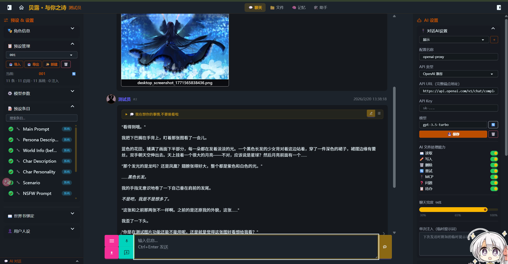
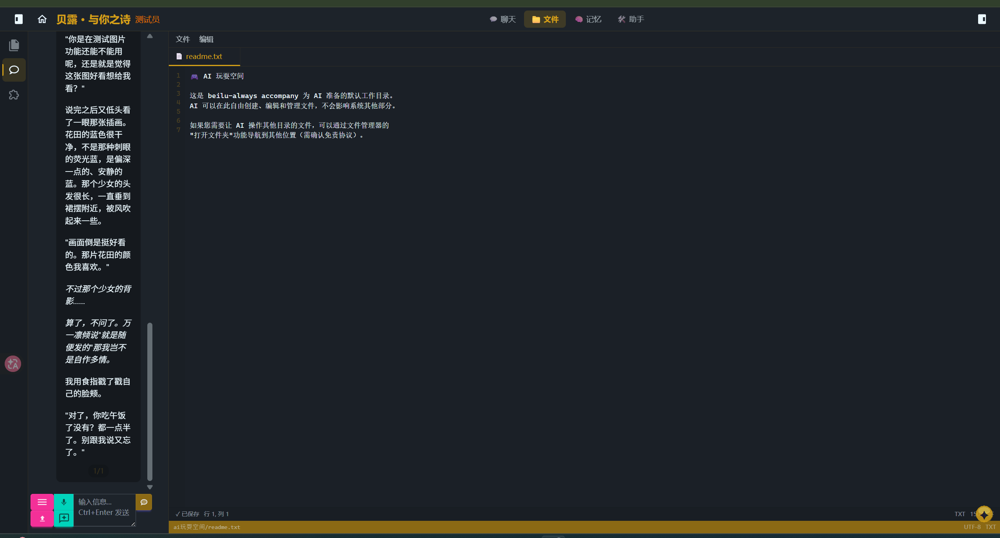
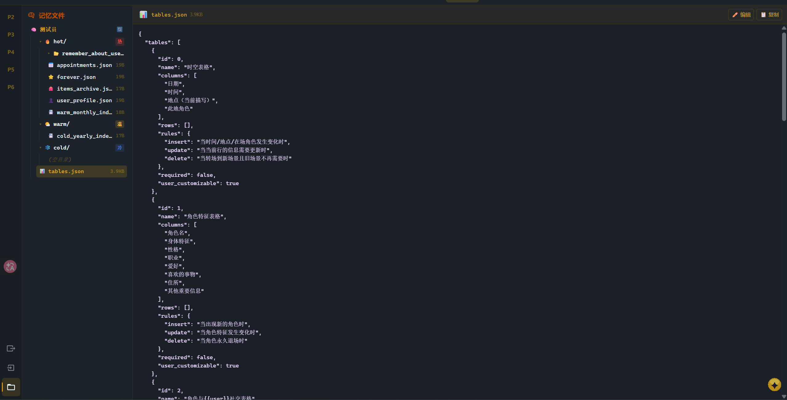
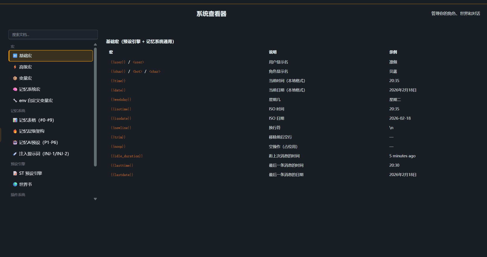
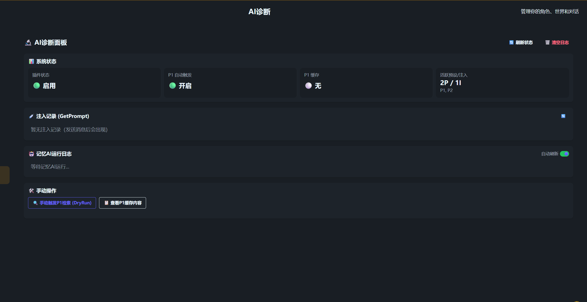

<p align="center">
  
</p>

# beilu-always accompany

> **让 AI 真正记住。**

beilu-always accompany 是一个**陪伴与工作一体的 AI 伴侣平台**，融合 **IDE 编辑环境**、**多 AI 协作引擎**、**原创分层记忆算法** 和 **兼容 SillyTavern 生态的聊天系统**，旨在从根本上解决当前 LLM 的两大瓶颈——**上下文窗口有限** 和 **注意力随上下文增长而分散**。

[English](README.md) | 中文

> 本项目由一名在校大学生独立完成全部设计与开发，借助 AI 辅助编程，融合算法设计、仿生学原理、框架架构和逻辑思维等多方面能力。

<p align="center">
  
</p>

<p align="center"><em>对话界面，可以进行各种精细调节，适配各种美化</em></p>

---

## 为什么需要这个项目？

### 当前 AI 的根本问题

无论是 AI 编程工具（Cursor、Copilot）、AI 聊天软件（ChatGPT、Claude）还是 AI 角色扮演平台（SillyTavern），都面临相同的底层限制：

| 问题               | 现状                                   | 后果                                    |
| ------------------ | -------------------------------------- | --------------------------------------- |
| **上下文窗口有限** | 即使 128K-1M tokens，长对话仍会溢出    | 早期对话被截断，AI 丢失关键信息         |
| **注意力分散**     | 上下文越长，模型对每段内容的关注度越低 | 即使信息在上下文中，AI 也可能"视而不见" |
| **无持久记忆**     | 关闭对话 = 遗忘一切                    | 每次新对话都从零开始                    |

### 我们的解决方案

**不把所有记忆塞进上下文，而是让专门的 AI 按需检索。**

```
传统方案：[全部历史记忆 + 当前对话] → 单个 AI → 注意力分散
                    ↓
我们的方案：[索引] → 检索 AI（专注找记忆）→ [精选记忆 + 当前对话] → 回复 AI（专注回复）
```

回复 AI 只看到经过检索 AI 筛选后的**精准记忆片段**，上下文干净、信噪比极高，注意力**完全不会发散**。

---

## 核心特性

### 🧠 原创分层记忆算法

参照人类大脑海马体的记忆形成机制与艾宾浩斯遗忘曲线设计，实现**理论上无限期的 AI 记忆**。

#### 三层记忆架构

```
🔥 热记忆层 (Hot) — 每轮自动注入
   用户画像 / 永久记忆 Top-100 / 未完成任务 / 近期关于用户的记忆

🌤️ 温记忆层 (Warm) — 按需检索，最近 1 个月
   每日总结 / 临时记忆归档 / 月度索引

❄️ 冷记忆层 (Cold) — 深度检索，超过 1 个月
   月度总结 / 历史日总结 / 年份索引
```

此外还有 **L0 记忆表格层**（10 张可自定义表格，每轮全量注入），提供结构化的即时上下文。

#### 关键数据

| 指标           | 数值                                                       |
| -------------- | ---------------------------------------------------------- |
| 热层每轮注入   | **~7,000-11,000 tokens**（128K 窗口仅占 5-9%）             |
| 检索 AI 上下文 | **<5,000 tokens**（100% 注意力集中于检索任务）             |
| 存储成本       | **零**（纯 JSON 文件，无数据库依赖）                       |
| 单角色持续运行 | **12+ 年**（按 5,000 文件计算）                            |
| 理论持续时间   | **260+ 年**（按 100,000 文件计算，NTFS/ext4 支持远超此数） |

#### 记忆衰减公式

```
score = weight × (1 / (1 + days_since_triggered × 0.1))
```

借鉴艾宾浩斯遗忘曲线，重要且近期触发的记忆优先注入，而非简单的时间顺序。

#### 纯提示词驱动 — 零硬编码限制

记忆系统最关键的设计特点：**所有记忆的注入、提取、归档、总结操作全部由 AI 通过提示词完成**，而非传统的硬编码逻辑。

这意味着：

- **记忆表格的含义和用途随时可改**：只需修改提示词中对表格的描述，AI 就会按新的方式理解和操作表格，无需改一行代码
- **归档策略可随时调整**：P2-P6 的行为完全由提示词定义，修改提示词即可改变归档规则、总结格式、检索策略
- **零技术门槛迁移**：用户可以自行编辑提示词来适配不同场景（角色扮演 / 编程助手 / 游戏 NPC），无需编程能力
- **天然避免技术债务**：没有复杂的解析器或状态机需要维护，AI 本身就是最灵活的"解析器"

### 🤖 多 AI 协作引擎

系统内置 **7 个 AI 角色**，各司其职：

| AI           | 职责                                      | 触发方式     |
| ------------ | ----------------------------------------- | ------------ |
| 聊天 AI      | 与用户对话、文件操作                      | 用户发送消息 |
| P1 检索 AI   | 从记忆层检索相关历史（最多 5 轮深度搜索） | 每轮自动触发 |
| P2 归档 AI   | 临时记忆超阈值时总结归档                  | 自动触发     |
| P3 日总结 AI | 生成当日详细总结                          | 手动触发     |
| P4 热→温 AI  | 将过期热层记忆转入温层                    | 手动触发     |
| P5 月总结 AI | 温→冷归档，生成月度总结                   | 自动/手动    |
| P6 修复 AI   | 检查并修复记忆文件格式                    | 手动触发     |

检索 AI 推荐使用 **Gemini 2.0/2.5 Flash**（速度快、成本低），回复 AI 可使用任意模型。

### 🖥️ IDE 风格界面

VSCode 风格三栏布局：

- **左栏**：预设管理 / 世界书绑定 / 人设选择 / 角色编辑
- **中栏**：聊天 / 文件编辑 / 记忆管理 三标签切换
- **右栏**：角色信息 / 功能开关 / 记忆 AI 操作面板

### 🔌 11 个功能插件

预设引擎 / 记忆系统 / 文件操作 / 桌面截图 / 日志 / 功能开关 / 多 AI 协作 / 正则美化 / 世界书 / 网络搜索 / 系统信息

### 🌐 多语言支持（i18n）

管理首页（beilu-home）支持 4 种语言，通过"翻译覆盖"方案实现——不破坏现有代码结构，给 DOM 元素添加 `data-i18n` 属性即可自动翻译。

| 语言代码 | 语言             |
| -------- | ---------------- |
| zh-CN    | 简体中文（默认） |
| en-UK    | English          |
| ja-JP    | 日本語           |
| zh-TW    | 繁體中文         |

- 语言偏好自动保存到 `localStorage`，刷新后保持
- 动态内容（JS 生成的文字）通过 `t(key)` 函数翻译
- 切换语言时触发 `beilu-lang-change` 事件，各模块自动响应

### 📦 兼容 SillyTavern 生态

- 直接导入 SillyTavern 格式的角色卡、预设、世界书
- 支持 Risu 格式（ccv3 / charx / rpack）
- 14 种 AI 服务生成器（proxy / gemini / claude / ollama / grok 等）

---

## 与现有工具对比

### vs AI 聊天软件（ChatGPT / Claude / Gemini）

| 维度       | ChatGPT 等           | beilu-always accompany             |
| ---------- | -------------------- | ---------------------------------- |
| 记忆       | 简单的摘要/对话历史  | 三层分级 + 多 AI 检索，理论无限期  |
| 注意力     | 上下文越长越分散     | 检索 AI 预筛选，回复 AI 注意力集中 |
| 自定义     | 有限的 System Prompt | 完整预设系统 + 10 张自定义记忆表格 |
| 数据所有权 | 服务器端存储         | 本地 JSON 文件，完全自主           |

### vs AI 编程工具（Cursor / Copilot / Windsurf）

| 维度       | Cursor 等          | beilu-always accompany                         |
| ---------- | ------------------ | ---------------------------------------------- |
| 项目记忆   | 基于当前文件上下文 | 跨会话持久记忆（架构决策、代码约定、历史讨论） |
| 多 AI 协作 | 单模型             | 7 个 AI 各司其职，检索/总结/回复分离           |
| 记忆成本   | 依赖大上下文窗口   | ~10K tokens 即可覆盖热层                       |

### vs AI 角色扮演平台（SillyTavern）

| 维度     | SillyTavern    | beilu-always accompany          |
| -------- | -------------- | ------------------------------- |
| 记忆     | 无内置记忆系统 | 原创三层记忆 + 6 个辅助 AI      |
| 文件操作 | 无             | 内置 IDE 文件管理 + AI 文件操作 |
| 桌面能力 | 无             | beilu-eye 桌面截图 → AI 识别    |
| 预设兼容 | 原生           | 完全兼容 ST 预设/角色卡/世界书  |

---

## 对未来 LLM 的思考

即使未来上下文窗口扩展到 **10M+ tokens**，分层记忆仍然有价值：

1. **注意力问题不会消失**：窗口再大，模型对海量文本的关注度仍然会下降。预筛选 + 精准注入永远优于"全部塞进去"。
2. **成本效率**：大窗口 = 高成本。用 ~10K tokens 的精选记忆替代 100K+ tokens 的全量历史，API 调用成本降低 **10 倍以上**。
3. **结构化 > 非结构化**：表格化的记忆比散落在对话中的信息更容易被 AI 准确读取和更新。

分层记忆不是上下文窗口的临时替代品，而是一种**更优的信息组织范式**。

---

## 路线图

### ✅ 已完成

- 原创三层记忆算法（纯提示词驱动）
- 多 AI 协作引擎（记忆 AI + 回复 AI）
- IDE 风格界面与文件操作
- 桌面截图系统（beilu-eye）
- 渲染引擎（JS-Slash-Runner 级别）
- 记忆表格增强
- 管理首页多语言支持（中/英/日/繁）
- 11 个功能插件

### 🔜 近期计划

- APT 条目切换增强
- Vector DB / RAG 语义检索
- Embedding API（OpenAI）

### 🔮 远期愿景

- **跨平台 Bot 接入**（Discord 等）
- **插件生态**（创意工坊式高拓展性）
- **Live2D 集成** + AI 操控模型
- **AI 游戏引擎**（对话界面 = 游戏界面，代码兼容、油猴脚本有效）
- **TTS / 文生图** 接入
- **VSCode 扩展兼容**
- 本体架构高拓展性

---

## 快速开始

### 环境要求

- [Deno](https://deno.land/) 运行时
- 现代浏览器（Chrome / Edge / Firefox）
- 至少一个 AI API Key（推荐 Gemini API，免费可用）

### 安装与启动

```bash
# 克隆项目
git clone https://github.com/beilusaiying/always-accompany.git
cd always-accompany

# 启动（Windows）
run.bat

# 启动（Linux/macOS）
chmod +x run.sh
./run.sh
```

启动后浏览器访问 `http://localhost:1314`

### 基础配置

1. **配置 AI 源**：首页 → 系统设置 → 添加 AI 服务源（proxy / gemini 等）
2. **导入角色卡**：首页 → 使用 → 导入（支持 SillyTavern PNG/JSON 格式）
3. **配置记忆预设**：首页 → 记忆预设 → 为 P1-P6 配置 API（推荐 Gemini 2.0 Flash）
4. **开始对话**：点击角色卡进入聊天界面

### 记忆系统使用

- **自动运行**：记忆表格由聊天 AI 自动维护（通过 `<tableEdit>` 标签），检索 AI (P1) 每轮自动触发
- **手动操作**：聊天界面右栏 → 记忆 AI 操作 → P2-P6 手动按钮
- **日终归档**：每天结束时点击「结束今天」按钮，触发日终 9 步归档流程
- **记忆浏览**：聊天界面 → 记忆 Tab → 浏览/编辑/导入/导出记忆文件

---

## 技术栈

| 组件     | 技术                              |
| -------- | --------------------------------- |
| 运行时   | fount（基于 Deno）                |
| 后端     | Node.js 兼容层 + Express 风格路由 |
| 前端     | 原生 JavaScript（ESM 模块）       |
| AI 接入  | 14 种 ServiceGenerator            |
| 桌面截图 | Python（mss + tkinter + pystray） |
| 存储     | 纯 JSON 文件系统                  |

---

## 致谢

本项目的诞生离不开以下开源项目和社区的贡献：

- **[fount](https://github.com/steve02081504/fount)** — 项目基础框架，提供了 AI 消息收发、服务源管理、模块加载等核心基础设施，为本项目节省了大量底层开发时间
- **[SillyTavern](https://github.com/SillyTavern/SillyTavern)** — AI 角色扮演领域的先驱项目，其预设格式、角色卡规范和世界书系统已成为社区标准，本项目完全兼容其生态
- **SillyTavern 插件社区** — 感谢所有开源插件作者的探索和分享，他们在渲染引擎、记忆增强、功能扩展等方面的实践，为本项目的功能设计提供了宝贵的参考和灵感

---

## 功能展示

<details>
<summary><strong>🖥️ IDE AI 编程界面 — 参考 VSCode，更好上手</strong></summary>

IDE AI 编程和修改文件界面，参考 VSCode 设计，更好上手。后期会加入插件接入和管理。

如果您不了解 AI 编程，或者是电脑小白，还请在指定空间游玩 AI 文件处理能力：📖 读取 / ✏️ 写入 / 🗑️ 删除 / 🔄 重试 / 🔌 MCP / ❓ 问题 / 📋 待办。通过关闭删除和写入功能保障安全。



</details>

<details>
<summary><strong>🧠 记忆文件界面 — 实时查看和编辑记忆数据</strong></summary>

人工可随时更改内容，同时可以在这里看到记忆 AI 的运作。也可以向记忆 AI 提出要求。



</details>

<details>
<summary><strong>🎨 正则界面 — 沙盒与自由模式</strong></summary>

处理正则的级别作用，还可以改变对话，有沙盒和自由模式。防范不明角色卡的代码造成损失。

> ⚠️ 我们不保证是否有效，所以还请检查该角色卡的代码是否有恶意脚本，同时我们也不会为造成的损失负责。


</details>

<details>
<summary><strong>📋 司令员级别提示词 — 掌管全部发送内容</strong></summary>

司令员级别提示词，掌管全部发送内容，将提示词的效力发挥到最大。


</details>

<details>
<summary><strong>🧠 记忆预设 P1-P6 — 纯提示词驱动，无技术门槛</strong></summary>

P2-P6 模式行为都可以用提示词修改，无技术门槛，适配性强。


</details>

<details>
<summary><strong>📖 系统说明 — 详细文档，快速上手</strong></summary>

详细的系统说明，让你快速上手使用。



</details>

<details>
<summary><strong>🔬 系统自诊断 — 更快反馈报错和问题</strong></summary>

完善的系统自诊断，可以更快反馈报错和问题。



</details>

---

## 许可证

本项目基于 [fount](https://github.com/steve02081504/fount) 框架开发，已与原作者直接沟通获得授权使用。
