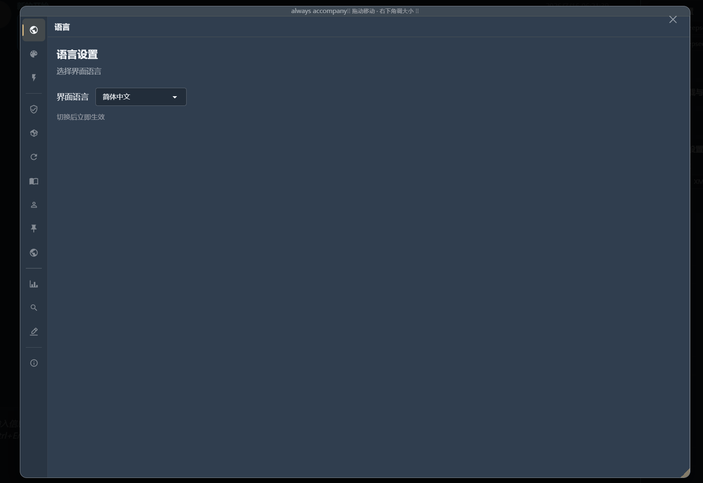
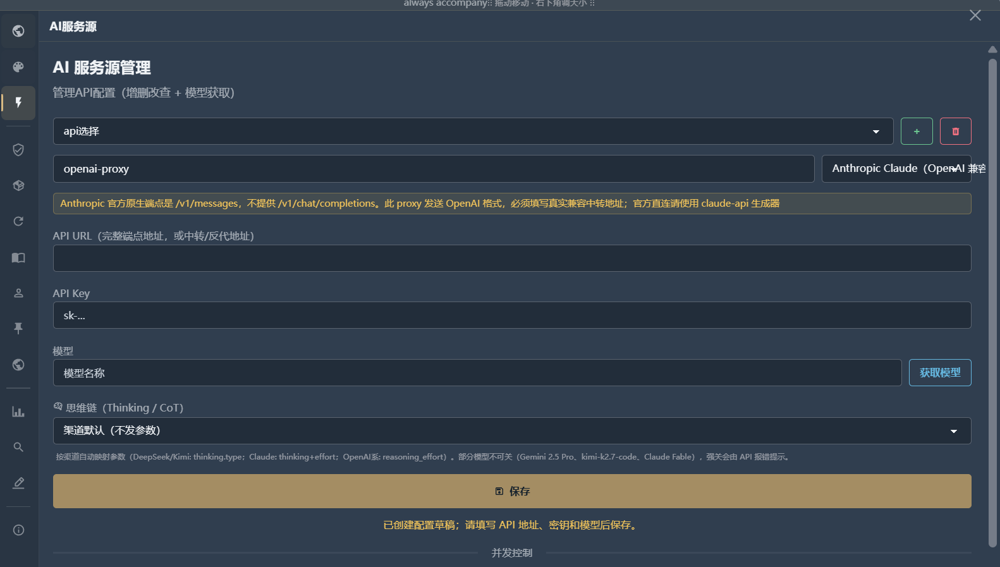
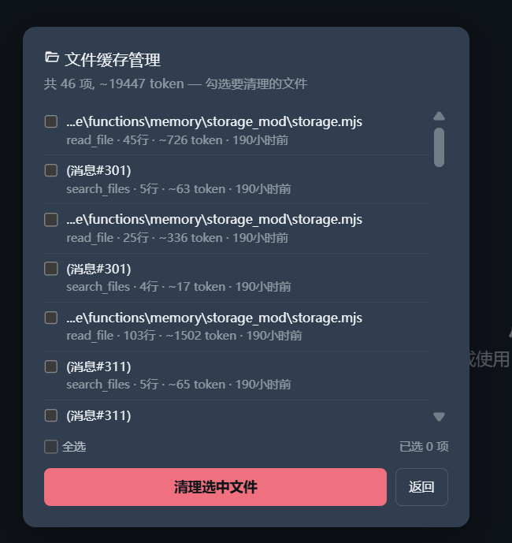
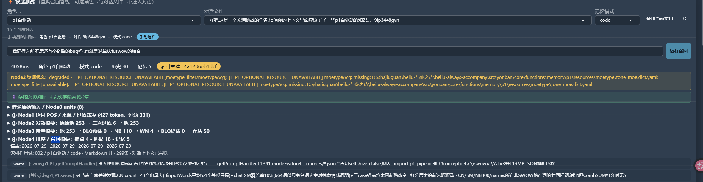
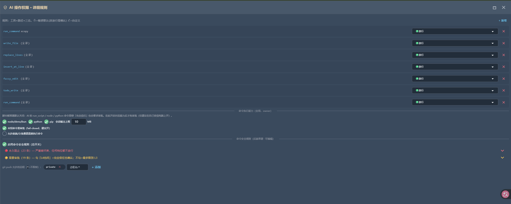

<p align="center">
  
</p>

<h1 align="center">always-accompany</h1>

<p align="center"><strong>コンテキストとアテンション機構に特化した、多元的な AI + Agent プロジェクト</strong></p>

<p align="center">同伴、チャット、コーディング、仕事が同じ記憶とコンテキストのフレームワークを共有します——SF 作品に出てくるあの AI のように、あなたに寄り添い、そして仕事も手伝う。</p>

<p align="center"><strong>動的アテンション · 固定注入 · プロジェクト隔離 · 専用モード</strong></p>

<p align="center">
  <a href="https://discord.gg/agHeDq9bqU"></a>
  &nbsp;
  <a href="https://github.com/beilusaiying/always-accompany"></a>
</p>

<p align="center"><a href="README.md">English</a> · <a href="README_CN.md">简体中文</a> · <a href="README_TW.md">繁體中文</a> · 日本語 · <a href="README_KO.md">한국어</a> · <a href="README_RU.md">Русский</a> · <a href="README_DE.md">Deutsch</a> · <a href="README_ES.md">Español</a> · <a href="README_FR.md">Français</a> · <a href="README_PT.md">Português</a></p>

> [!NOTE]
> **開発について：**本プロジェクトの主要部分は一人で約3か月かけて完成させ、その後約1か月をアルゴリズムの集中的な最適化に充てました。開発期間が短く、機能範囲も広いため、現時点ではプロジェクト構成、基本機能、境界条件の処理に不安定または未完成な部分が残っている可能性があります。一部の基本機能は AI の支援を受けて実装しましたが、複雑な機能の枠組み、アルゴリズム、主要設計は作者自身が計画・指揮しているため、モジュールごとに成熟度が異なります。今後も人手によるレビュー、微調整、エンジニアリング面の改善を継続します。バグを見つけた場合は、再現手順とログをお寄せください。
>
> **今後の計画：**新しいプラグインや機能領域の追加を止め、コアの縮小、結合度の低減、分離可能な機能のプラグイン層への段階的な移行に注力します。詳細で安定したプラグインプロトコルを整備した後、フレームワークをエンジニアリング面から最適化し、段階的にリファクタリングします。あわせてテスト、ドキュメント、コントリビューション手順を改善し、より多くの開発者が理解・拡張・参加できるプロジェクトを目指します。

---

## そのまま何ができる？

- 長期のチャットとロールプレイができ、SillyTavern のキャラクターカード・プリセット・ワールドブックなどのコミュニティ形式をそのままインポートできます；
- ローカルの Agent ワークベンチのように、プロジェクトのファイルを読み書きし、コマンドを実行できます；
- Live2D / 画像デスクトップペット、画面認識、ゲーム同伴、音声入力、そして 9 プラットフォームをカバーする Bot システムを通じて、ブラウザの外へと広がります；
- 長期的な素材をローカルファイルに保存し、毎ターン、現在の問題に関連する断片を自動的に見つけ出し、もう不要になった古いコンテキストを退場させます；
- キャラクター、プロンプトの内容と順序、注入する身元と位置、条件付きトリガールール、記憶リコール経路、権限とプラグインを編集し、自分だけの AI へと作り替えられます。

**私たちは何を持っているのか？** これらの画面の背後には同じ一つのシステムがあり、本当の違いは次の四つに集約されます：

- **階層化された記憶とコンテキスト** — Data + hot / warm / cold の階層で長期素材を保存し、コンテキストを収集し記憶を検索するツール（P1）が毎回の回答前に現在関連する断片をリコールします；コンテキストのクリーンアップはファイル読み取り単位の粒度で可逆に行え、AI 自身が不要になった既読ファイルを手放すこともできます；
- **中核の動作を確認・設定可能** — キャラクター、プロンプト、注入、記憶、リコール経路、権限、プラグインには、それぞれ編集または設定の入口があります；
- **プラグインベースの拡張フレームワーク** — コア機能はプラグインとして構成され、中間の情報ステーションを経て伝達され、フロントエンドが表示と操作を担います；ユーザープラグインは JS、Python、または独立したプログラムで書けます；
- **統合された agent ツールチェーン** — 同じ記憶とコンテキストのフレームワーク上で、ファイル、コマンド、ブラウザ連携、MCP、複数ウィンドウ、承認、復元を提供します；実際に利用できる範囲と結果は、選択したモード、設定、実行環境、モデル、外部サービスによって異なります。

---

## クイックスタート

必要なものは二つだけ：

- 使える AI API が一つ；
- 簡単なプロンプトが書けること。

この二つがあればすぐに体験を始められます。あらかじめお伝えしておくと：現時点で AIRP と Chat のプロンプトはまだ作り込みの最中です——今の段階では生産性を主軸にしており、同伴向けの磨き込みは順次補っていきます。

チャットを始めたいだけなら、これがコストのすべてです。自律駆動 P1 のローカル検索サービス（現在の実測でピークメモリは約 2 GiB 規模）は丸ごとオフにできます；P1 のパラメータ、プロンプトの注入位置、Code、Work、そしてプラグインは、いずれも必要に応じて深掘りする設定であって、初回利用の前提課程ではありません。

```bash
git clone https://github.com/beilusaiying/always-accompany.git
cd always-accompany
run.bat          # Windows
# または chmod +x run.sh && ./run.sh   # Linux / macOS
```

ランチャーは Deno が無ければ自動でランタイムをダウンロードし、依存関係が不完全ならインストールまで済ませます。ページの準備が整うと通常はブラウザが自動で開きます；手動で `http://localhost:1314` にアクセスしても構いません。

| 1. 画面の言語を選ぶ | 2. AI サービスソースを紐付ける |
|---|---|
|  |  |

サービスのアドレス、API Key、モデルを入力し、保存してからキャラクターカードを選ぶかインポートすれば、チャットを始められます。少なくとも一つの使える AI API が必要です；モデルの能力と費用は、あなたが紐付けたサービス次第です。アプリには [Wiki](site/wiki/getting-started/overview.md) が内蔵されており、[オンライン版](https://beilusaiying.github.io/always-accompany/)にもアクセスできます。

> 初回起動は通常より時間がかかります：ランタイムが依存関係をダウンロードし、ローカルデータを初期化する必要があるためです。ページが完全に表示されてから操作してください；以降の起動はもっと速くなります。音声、デスクトップペットなどのオプション機能には、それぞれ独自の初回ダウンロードや環境要件がある場合があります。

---

## 機能一覧

<table>
<tr>
<td width="33%">

**💬 チャット / ロールプレイ**


</td>
<td width="33%">

**🖥️ IDE コーディングモード**


</td>
<td width="33%">

**📊 Work モードと PPT**


</td>
</tr>
<tr>
<td width="33%">

**🐾 Live2D デスクトップペット + 画面認識**


</td>
<td width="33%">

**🔒 6 段階の権限テンプレート + ツール単位のルール**


</td>
<td width="33%">

**🗜️ 階層圧縮 × 一件ずつ制御可能**


</td>
</tr>
</table>

- **🧭 四大メインモード + 補助ビュー**：Smart 全智能、Chat チャット / ロールプレイ、Code コーディング、Work 仕事がそれぞれ独立した記憶テーブルと P1 経路を持ちます；ほかに Bot 管理、ゲーム同伴、記憶管理、ST 適応などの補助ビューがあります；
- **🧠 Data（編集可能な構造化記憶テーブル）+ 三層記憶**：Data と `hot / warm / cold` の通常の JSON / MD ファイルが、それぞれ現在の事実、近期の素材、アーカイブを受け持ちます；内容は閲覧でき、編集できます；
- **🎯 P1（前置記憶リコール）**：メイン AI が回答する前に、まず現在のキャラクターとモードが読み取りを許可した長期素材の中から関連する断片を探します。Chat / Code / Work は現在デフォルトでローカルアルゴリズム経路を使います；Smart / Bot モードは独立した AI 検索経路を残しています；二つの経路は排他的で、オフにもできます；
- **🗜️ コンテキスト管理**：メッセージ、ファイル読み取り、ツール結果、システム注入ごとに占有量を確認できます；通常のクリーンアップは内容を隠して AI に送らなくするだけで、記録はディスクに残り、復元できます；
- **📊 モード別記憶テーブル**：Chat には #0–#9 のテーブルがあり、Code と Work は独自のテーブルとプライベートディレクトリを使い、すべての場面を同じ一枚のテーブルに詰め込みません；
- **👑 主なプロンプト項目は編集可能**：キャラクター定義、プリセット、INJ 項目、モード説明、記憶データスロット、ツール説明では、対応するエディターが提供する内容、順序、オン / オフ、役割、注入位置、条件を調整できます；フレームワークの安全ラッパーとプロバイダー固有のメッセージ変換はコードで管理されます；
- **💻 IDE 級のワークフロー**：三ペインレイアウト、ファイル読み取りと編集、コマンド実行、タスクリスト、複数ウィンドウと VS Code 拡張ブリッジ；
- **🔌 MCP（外部ツール接続プロトコル）**：JSON を貼り付けて外部ツールを接続します；コマンド型サービスは owner と環境変数ホワイトリストなどのセキュリティゲートを通す必要があります；
- **🐾 デスクトップペットとゲーム同伴**：Live2D / 画像パック、三種類の画面認識方式、能動的コメント、独立したゲーム同伴ループと適応的な頻度；
- **🎙️ ローカル音声入力**：MOSS-Transcribe-Diarize によるローカル文字起こしで、話者分離とタイムスタンプに対応します；現時点では音声から文字への変換のみで、AI 読み上げは含みません；
- **🤖 9 プラットフォームの Bot**：現在のソースには Discord、Telegram、Slack、LINE、Feishu、DingTalk、WeChat、WeCom、X プラットフォームのシェルが含まれます；各プラットフォームは依然として、それぞれの要件に沿って Token、Webhook、あるいはサードパーティのブリッジを設定する必要があります；
- **🔎 オプションの意味ベクトル検索**：beilu-vectordb（Orama ベースで、全文 / ベクトル / ハイブリッド検索に対応）を内蔵しており、デフォルトはオフで、embedding エンドポイントを自分で設定してから有効にします；自律駆動 P1 とは補完関係であって、二者択一ではありません；
- **🧩 プラグインシステム**：現在のソースには 23 個の内蔵プラグインディレクトリがあり、新規ユーザーテンプレートはデフォルトで 14 個を列挙します；さらに Python、Node、あるいは独立したプログラムでユーザープラグインを書けます；
- **🛡️ ローカルデータと復元**：アプリのデータはローカルに保存され、非表示からの復元、回収、バックアップチェーンに対応します；リモート AI やリモート embedding サービスに送られる内容は、依然としてあなたが選んだサービスのデータポリシーに従います；
- **🌐 多言語 · 🔬 ホワイトボックス診断 · 🎨 複数のテーマ**：コアの中 / 英 / 日 / 繁体字の画面に加えて、他のコミュニティ翻訳も提供します。一部の低リソース言語は不完全な場合があります。

---

## 私たちは結局、何を解決しようとしているのか？

記憶を保存すること自体は、別に神秘的なことではありません。Data は書き込めるテーブル一枚、`hot / warm / cold` は要するに「時間 + 出来事」でフォルダを三つ作って md を書き溜めていくだけ；INJ（編集可能なプロンプト注入項目）とプリセットも、SillyTavern などのキャラクター系フロントエンドが長らく探ってきたプロンプト編成の流儀を受け継いだものです。

それらを P1（コンテキストを収集し記憶を検索するツール）と組み合わせることで、「ベクトル + 動的注入 + 記憶が現在のタスクに追従する」という設定可能な流れになり、ファイル読み取り単位のコンテキスト整理も同じ経路に含まれます。実際のリコールと圧縮の結果は、選択したモード、設定、素材、モデルによって異なります。

じつは最初、私たちは P1 を小さな AI として単独でデプロイするつもりでした。ところ本当の問題は保存した後に出てきます：記憶がどんどん膨らんでいくとき、毎ターンわざわざ二つ目の AI を起動して探させて、速度と費用は本当に耐えられるのか？小さな AI に全部見つけ切れるのか？必ず有料 AI でなければならないのか？覚えれば覚えるほど、反応は遅くなっていくのではないか？

日常に落とし込めば、いくつかの見慣れた場面になります：大きなプロジェクトで、AI にまず経路、フレームワーク、MD を見せてからタスクを渡したのに、途中まで進んだところで token が満杯になりかけ、一度圧縮すればもう一度見直しになる——複数の agent を同時に走らせるとき、コンテキストはなおさら惨事です；長いタスクの中で AI は数行だけ変わった同じファイルを何度も読み、コンテキストは積み上がって溢れていくのに、あなたはそれを消せない；新しいプロジェクトを始めたいだけなのに、AI が以前の古いプロジェクトの記憶にがっちり錨を下ろしてしまうこともあります。

これらは根拠のない仮定ではありません：

- [Issue #6](https://github.com/beilusaiying/always-accompany/issues/6)
- [Codex #35226](https://github.com/openai/codex/issues/35226) · [Claude Code #34556](https://github.com/anthropics/claude-code/issues/34556)；
- [コミュニティの議論](https://www.reddit.com/r/SillyTavernAI/comments/1q7p33c/how_longterm_memory_works_in_sillytavernai/)；
- Web チャット製品のユーザーも、プロジェクト記憶の透明性やプロジェクト間の混線の問題を挙げています：[検索の透明性の要望](https://community.openai.com/t/feature-request-make-project-memory-transparent-searchable-and-user-controlled/1385159) · [プロジェクト専用記憶の要望](https://community.openai.com/t/project-specific-memory-in-chatgpt/1140856)。

### 保存した後、どうやって AI に出力するか

自社開発の **P1 前置記憶リコール**を通じて：まずユーザーの現在の対話を軸に検索の手がかりを広げ、それから現在のキャラクターとモードが読み取りを許可した長期素材の中から関連する原文を見つけ出し、メイン AI に渡します。これはモデルの外で動く動的アテンション機構だと理解してもらって構いません——現在の問題が何を探すかを決め、長期素材が候補を提供し、このターンで選ばれた断片だけが回答に入ります。

使う側から見ると、これはこういう意味です：あなたは元の文を復唱する必要はなく、関連はするが完全には一致しない一言でも、古い出来事を連れ戻せることがあります；リコールの後、画面には今回実際にどの記憶が使われたかが表示されます——あなたが検証するのは記録そのものであって、AI の「覚えています」という一言ではありません。

---

## 詳細な機構

<details>
<summary><strong>🧠 Data と三層再帰記憶 — なぜやはり階層化するのか</strong></summary>

`hot / warm / cold` はまず読み書き可能なライフサイクルディレクトリであって、神秘的なデータベースではありません：

```text
🔥 hot  — 近期・高頻度・使用中の素材
🌤️ warm — 段階的な整理とアーカイブ素材
❄️ cold — より長期の歴史素材
📊 Data — 現在のモードで編集・検証できる構造化された事実
```

階層化により、固定注入、必要に応じたリコール、深層アーカイブがそれぞれ異なるコストと用途を持てます。原始素材は通常の JSON / MD に残るので、ユーザーは直接点検し訂正できます；P1 はそのうえで、このターンにどの層から断片を取り戻すかを決めます。

長コンテキストの研究では、位置バイアスと、タスクが複雑になった後の利用率低下がすでに観測されています：[Lost in the Middle](https://aclanthology.org/2024.tacl-1.9/) · [RULER](https://arxiv.org/abs/2404.06654) · [Found in the Middle](https://aclanthology.org/2024.findings-acl.890/)。これらの論文は「入れられる」ことと「安定して使える」ことが同じではないことを示しますが、本プロジェクトの方式のほうが優れていることを直接証明するものではありません。

</details>

<details>
<summary><strong>🗜️ コンテキスト管理 — 全段圧縮からファイル読み取り単位のクリーンアップまで</strong></summary>

AI が実際のタスクを実行すると、大量のプロセス内容が生まれます：何度も読み返したファイル、古いツール結果、すでに消費された指示タグ、時代遅れになったメッセージ。always-accompany は自動圧縮、種類別クリーンアップ、一件ずつの選択を同時に提供します；デフォルトのクリーンアップは `_hidden` マークを使い、記録をディスクに残したまま、AI には送らなくします。

AI も `<contextClean>` を出力してクリーンアップを要求できます；システムはユーザーの原話を保護し、最低 token 閾値を設定できるので、コンテキストがまだ小さいうちに頻繁にプロンプトキャッシュを壊すのを避けられます。永久的あるいは高リスクの操作を、通常の非表示と混同すべきではありません。

| 多層圧縮と粒度 | ファイル読み取り単位のクリーンアップ |
|---|---|
|  |  |

一般ユーザーは、もう不要になったファイル読み取りやメッセージを選ぶだけで済みます；さらに深く制御したいときに、token の内訳、種類、時間、来源を確認します。

</details>

<details>
<summary><strong>🔬 自律駆動 P1 — モデルの外にある動的記憶アテンション鎖</strong></summary>

現在の本番の鎖は Node0–4 であって、旧文書にある 21 ノードの記述ではありません：

```text
Node0  現在の入力 + 直近のユーザーメッセージ + 現在のモードの Data
  ↓
Node1  分かち書き、品詞、時間、固有名詞とフレーズのアンカー
  ↓
Node2  SWOW / ConceptNet / 词林 / ATOMIC / 領域語などの関連拡張
  ↓
Node3  BLQ(自社アルゴリズム) / NB300 / WordNet などの多証拠シグナルによるフィルタ
  ↓
Node4  Data、hot / warm / cold とモード記録へ戻り、BM25、時間、階層、Top、importance などで並べ替え
  ↓
recalledRecords + directionWords + trace
```

連想語は記憶された事実ではありません；候補は実際の記録層へ戻って初めて、最終的なリコール結果になれます。ホワイトボックスパネルは、入力ユニット、各ノードの候補と削除理由、インデックス状態、最終来源とエラーを表示するので、「リコールされなかった」のが、マッチが無かったのか、資源の縮退なのか、鎖の失敗なのかを判断しやすくなります。



ホワイトボックスパネルは、各ノードと実際の来源がすべて点検可能であることを証明します；リコールの品質は、依然として同一の語料、同一のタスク、そして標準解答付きのデータの上で評価する必要があります。完全な実行境界は [P1 現行本番契約](site/wiki/p1-recall/ch7-current-runtime.md)を参照してください。

</details>

<details>
<summary><strong>👑 主なプロンプト項目は編集可能 — デフォルトのまま使え、用途に合わせて設定できる</strong></summary>

キャラクター定義、プリセット、INJ 項目、モード説明、記憶データスロット、ツール説明などの主なプロンプト項目は画面で編集できます。各項目ではエディターが実際に提供する設定を調整でき、フレームワークの安全ラッパーとプロバイダー固有のメッセージ変換はコードで管理されます：

- 実際の文面
- 前後の順序
- 有効にするかどうか
- system、user、assistant のどの身元で送るか；
- チャット履歴のどの位置に挿入するか；
- Chat、Code、Work、Bot、あるいは指定した条件下でのみ有効にするか。

</details>

<details>
<summary><strong>🔒 AI は行動できるが、操作の種類ごとに固有の境界がある</strong></summary>

ファイル書き込みは、ツール、パス、三状態ルールに従って `deny / ask / allow` が決まります；コマンドはさらにブラックリスト、グレーリスト、リモートホワイトリストを通ります；server 配備下では、機微な設定と子プロセスの能力は owner が有効化する必要があります。

L0–L5 は、厳格な制御から全面的な許可までの一連のショートカットテンプレートで、ユーザーはさらに具体的なツールとパスまで細分化できます。L5 は承認をスキップする、明確に高リスクな選択です；ワークスペースのフェンス、配備モード、各プラグイン独自のセキュリティゲートは、依然として個別に理解しておくべきです。



</details>

<details>
<summary><strong>🏗️ システムアーキテクチャと隔離境界</strong></summary>

always-accompany は Deno バックエンドとネイティブ Web フロントエンドで動き、Shell、Plugin、Service Generator と yonban 機能層を通じて能力を構成します。画面の呼び出し、モードのルーティング、ファイル / ツールの実行、永続化、非同期結果には、それぞれ明確な入口があります。

| 境界 | 現在の役割 |
|---|---|
| ユーザー | マルチユーザー / server 場面での永続化のルート境界 |
| キャラクターカード | 異なるキャラクター、関係、顧客、プロジェクトが、異なる記憶ルート、設定、対話を使う |
| モード | Chat / Code / Work が異なるテーブル、プライベートディレクトリ、プリセット記録、P1 経路を使う；同じキャラクターカードの共通の長期素材は依然として共有されることがある |
| ウィンドウ | このターンの入力、P1 候補と結果、ワークスペース、非同期の返送を制約する |

</details>

<details>
<summary><strong>🔭 1M、2M、そしてさらに大きなコンテキストウィンドウについて</strong></summary>

より大きなウィンドウは非常に価値がありますが、容量、アテンション、コスト、タスク状態は同じ一つのことではありません。always-accompany が階層化とリコールをやるのは、主にアテンションを高め、コンテキストの中での保存の仕方を最適化するためで、とりわけ今の大規模なコードプロジェクトと長期のチャットに向けています。

もしかしたら、あなたも経験があるかもしれません：チャットが長くなり、記憶が増えるほど、AI が受け取るものは増えるのに、反応と記憶のほうはかえって混乱し始め、遅くなっていく；コードを書くほうはこうです——たとえ 1M のコンテキストを与えられても、大きなプロジェクトはすぐに上限にぶつかります。

</details>

---

## ロードマップ

**現在のリポジトリにすでに備わっている入口と実装**：Data + 三層記憶 · コンテキスト管理 · 自律駆動 P1 / AI P1 · プロンプト項目の編集とプリセット切り替え · モード記憶テーブル · 条件付き知識の動的注入 · Live2D / 画像デスクトップペット · 画面認識とゲーム同伴 · ローカル音声入力 · PPT 生成 · MCP · 複数ウィンドウ · VS Code 拡張ブリッジ · 9 プラットフォームの Bot · 23 個の内蔵プラグインディレクトリ · ユーザープラグインホスト · 回収 / バックアップチェーン · ホワイトボックス診断 · 多言語とテーマ。

**近期の方向**：さらに多くの Bot プラットフォーム · プラグインの生態系とサンプル · TTS / 文章から画像 · AI ゲームエンジン（決定論的な数値状態 + LLM の物語 + シンボリックレンダリング）

---

## 技術スタック

Deno ランタイム（Node.js 互換） · Express 風のルーティング · ネイティブ JavaScript / ESM フロントエンド · WebSocket · JSON / MD のローカルストレージ · Electron デスクトップペット · Python のオプションサービス（P1 資源、STT、PPT）· discord.js v14 · VS Code 拡張ブリッジ。

アーキテクチャの説明は[システムアーキテクチャ](site/wiki/developer/architecture.md)を、メッセージ・ツール・権限の鎖は [YonBan ツール体系](site/wiki/yonban/tools.md)と[承認機構](site/wiki/yonban/approval.md)を参照してください。

---

## コミュニティ

<a href="https://discord.gg/agHeDq9bqU"></a>

キャラクターカードの共有 · プリセットと条件付き知識の公開 · プラグインの貢献 · バグの報告 · 実際の使用事例の提案 · benchmark への参加 · コードの貢献。

---

## 使用している技術と資源

- **音声文字起こし**：[MOSS-Transcribe-Diarize](https://huggingface.co/ICTNLP/MOSS-Transcribe-Diarize)（ローカル配備、モデルは約 1.8 GB、初回使用時に単独でダウンロード）
- **単語ベクトル**：[ConceptNet Numberbatch](https://github.com/commonsense/conceptnet-numberbatch)（Speer & Lowry-Duda, 2017）
- **連想データ**：[SWOW（Small World of Words）](https://smallworldofwords.org/) 中国語連想データ
- **分かち書きと辞書**：THUOCL、CoreNatureDictionary、Chinese-Synonyms などの公開資源
- **検索エンジンブリッジ**：[ddgs](https://pypi.org/project/ddgs/)（検索リクエストと結果取得に使用）

## 謝辞

- **[fount](https://github.com/steve02081504/fount)** — プロジェクト初期の参考フレームワークで、AI メッセージ処理、サービスソース管理、モジュールロードなどの基盤インフラの発想を提供し、多くの低レベル開発の時間を節約してくれました；
- **[SillyTavern](https://github.com/SillyTavern/SillyTavern)** — AI ロールプレイとプロンプト生態系の重要な先駆者です。always-accompany はそのキャラクターカード、プリセット、ワールドブックなどのコミュニティ形式のインポートに対応しています；
- **SillyTavern プラグインコミュニティとすべてのオープンソース資源の作者たち** — レンダリング、キャラクター、拡張、検索、ツールチェーンにおける探求と共有に感謝します。

## なぜこのプロジェクトを作るのか

> 本プロジェクトの設計、アーキテクチャ、開発は、仕事を探している一人の引きこもりによって完成されました(大嘘)。AI 支援によるプログラミングの力を借り、アルゴリズム設計、生体模倣の発想、フレームワークアーキテクチャ、そして論理的思考を一つに結び合わせています。

always-accompany は、流行りの機能を同じメニューに詰め込むために作られたのではありません——最初はただ、作者自身が使いたかっただけです :)。プラグインとフレームワークの仕組み、および複数の表示言語を備えていますが、実際の対応範囲はプラグインと翻訳リソースによって異なります。

---

<details>
<summary><strong>📸 さらに多くの機能スクリーンショット（クリックして展開）</strong></summary>

| | | |
|---|---|---|
|  **PPT 全工程** |  **セキュリティとタスクフロー** |  **セキュリティ防護センター** |
|  **多言語対応** |  **複数のテーマ** |  **内蔵 Wiki** |
|  **サブモードのワークフロー** |  **コンテキストの早見** |  **自動 / 定時 Loop** |
|  **環境検出** |  **記憶ファイル構造** |  **ブラウザ自動化** |
|  **外部インターフェース** | | |

</details>
