<p align="center">
  
</p>

<h1 align="center">always accompany</h1>

<p align="center">
  <a href="https://discord.gg/agHeDq9bqU"></a>
  &nbsp;
  <a href="https://github.com/beilusaiying/always-accompany"></a>
</p>

<p align="center"><a href="README.md">English</a> | <a href="README_CN.md">中文</a> | <a href="README_TW.md">繁體中文</a> | 日本語 | <a href="README_DE.md">Deutsch</a> | <a href="README_ES.md">Español</a></p>

<p align="center">📖 <a href="https://beilusaiying.github.io/always-accompany/">オンライン Wiki（使い方ガイド）</a> &nbsp;·&nbsp; 📄 <a href="docs/p1-paper/README.md">P1 技術論文</a></p>

> 本プロジェクトは、大学を卒業したばかりの学生が一人で設計・アーキテクチャ・開発のすべてを完遂したものです。AI 支援プログラミングを活用しつつ、アルゴリズム設計・生体模倣（バイオミメティクス）の原理・フレームワーク設計・論理的思考など、多方面の能力を融合させています。

---

```bash
git clone https://github.com/beilusaiying/always-accompany.git
cd always-accompany
run.bat          # Windows
# または chmod +x run.sh && ./run.sh   # Linux/macOS
```

ブラウザで `http://localhost:1314` を開く → AI サービスソースを設定 → キャラクターカードをインポート → チャット開始。Deno ランタイムは初回起動時に自動でダウンロードされるため、手動インストールは不要です。少なくとも 1 つの AI API キーが必要です。アプリには完全な wiki チュートリアルが内蔵されています。

> **ご注意：** 初回起動には時間がかかります。ランタイムが依存関係をダウンロードし、データベースを初期化する必要があるためです。ページが完全に読み込まれるまでお待ちください。2回目以降の起動はずっと速くなります。

---

3 層の再帰記憶（日→月→年アーカイブ、純粋な JSON、260 年分の容量）+ 前置検索 AI（関連する記憶を探すことだけに専念する専任 AI で、見つけたものだけを返信 AI に渡す。両者はそれぞれの役割に専念する）+ 階層的コンテキストクリーンアップ（クリアしても送信対象から外れるだけで、元のテキストは残り、いつでも復元できる）。この 3 つが噛み合うことで、AI はコンテキストウィンドウの制約を受けずに、あなたが言ったすべての言葉を覚え続けられます。この基盤の上に、チャット/ロールプレイ、IDE コーディングモード、ワークモード（AI によるスライド作成を含む）、Live2D デスクトップペット（画面認識+ゲーム同伴）、音声入力、Discord Bot、MCP 外部ツール接続を構築しました——すべての入口が同じ記憶を共有するため、ウィンドウを切り替えても AI はあなたを覚えたままです。現在改良中の次世代検索エンジン（21 ノードの純アルゴリズムパイプライン、LLM ゼロ・ネットワークゼロ、ミリ秒級、目標は文単位のアテンション）。

---

## 機能一覧

<table>
<tr>
<td width="33%">

**💬 チャット / ロールプレイ**
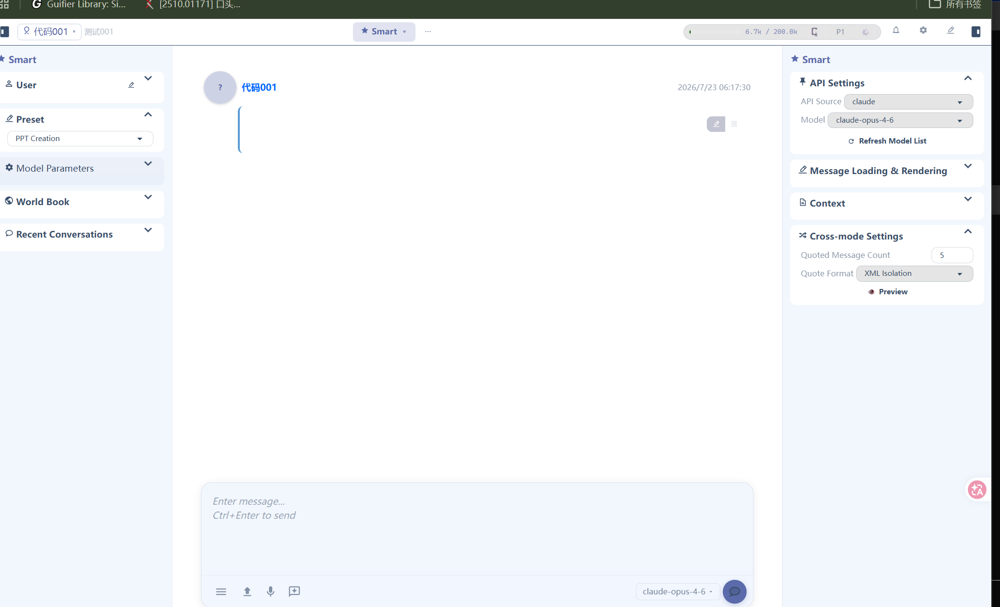

</td>
<td width="33%">

**🖥️ IDE コーディングモード**
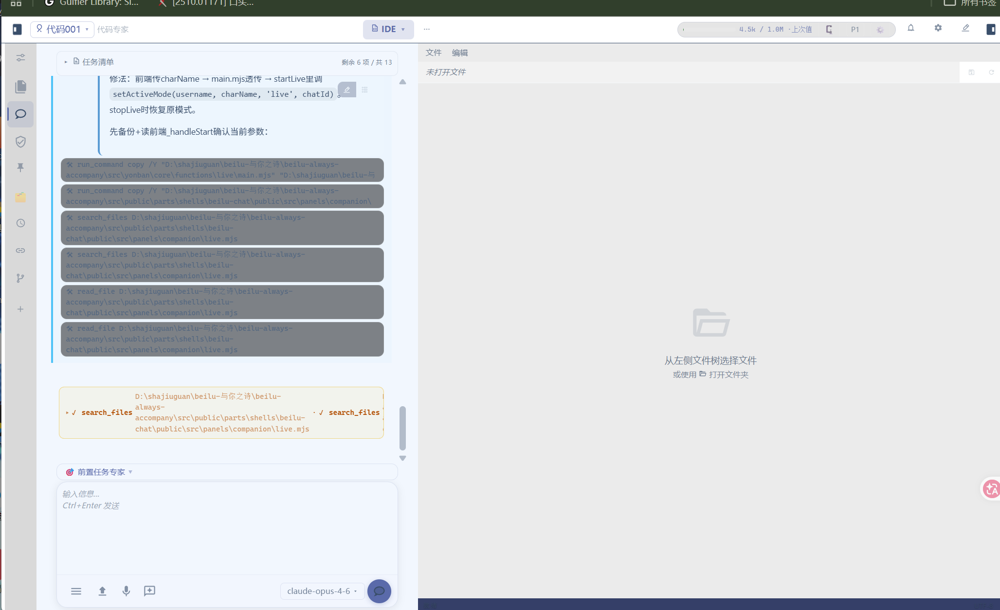

</td>
<td width="33%">

**📊 ワークモード（AI によるスライド作成）**
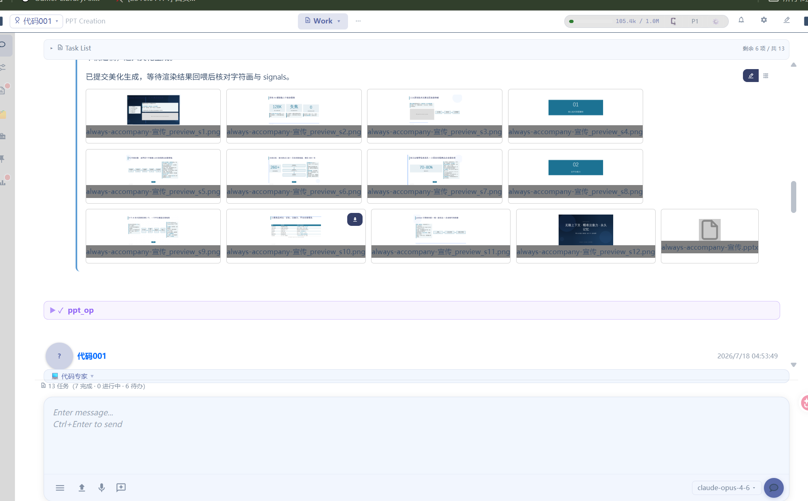

</td>
</tr>
<tr>
<td width="33%">

**🐾 Live2D デスクトップペット + 画面認識**
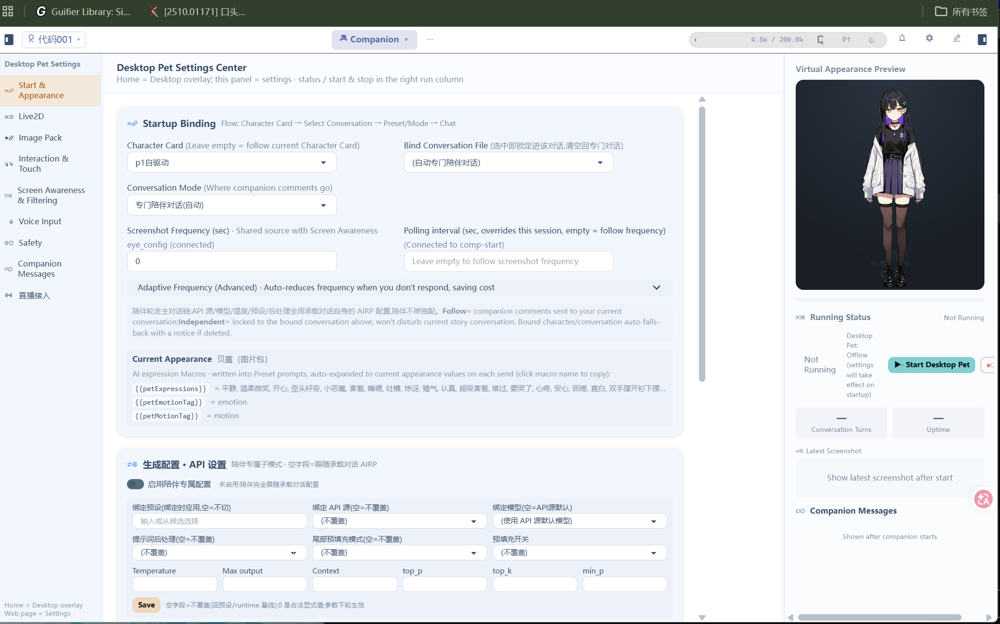

</td>
<td width="33%">

**🔒 L0–L5 6段階権限ゲート**
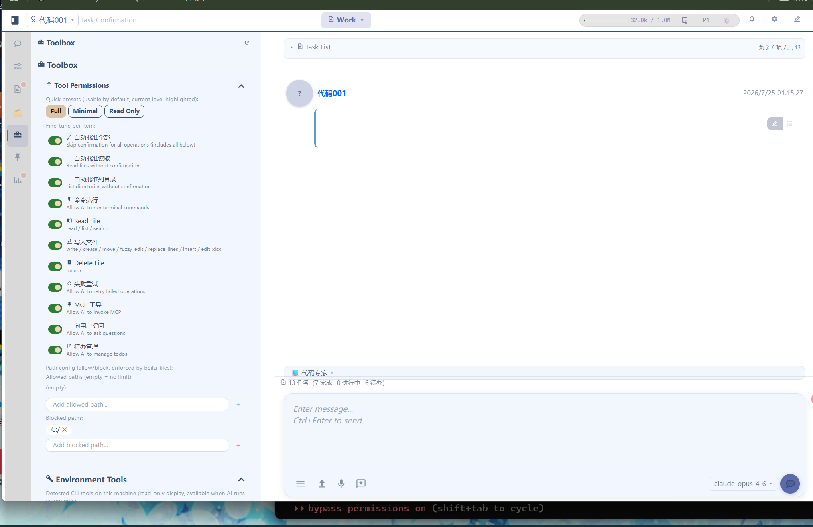

</td>
<td width="33%">

**🗜️ 階層圧縮 × 一行単位の制御**
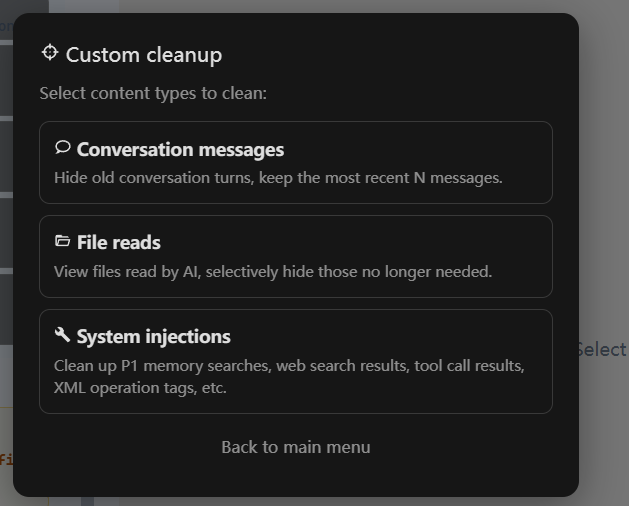

</td>
</tr>
</table>

- **🧠 3層記憶**：ホット（毎ターン注入）/ ウォーム（オンデマンド検索）/ コールド（深層アーカイブ）、純粋な JSON + 完全にプロンプト駆動、データベース不要
- **🎯 P1 前置検索**：専任の小型 AI がまず記憶を探し、返信 AI に引き渡す。BM25 + 正規表現のデュアルエンジン、検索は無料モデルでも利用可能
- **🗜️ 圧縮システム**：3段階の階層（ワンクリック/種類別/一行単位）× 4種類の粒度（対話/ファイル読み込み/システム注入/過程内容）+ AI 自律型 `<contextClean>` クリーンアップ、すべて復元可能
- **📊 10 種の記憶テーブル**：構造化ストレージ、AI が `<tableEdit>` で自動維持し、情報の隔離を実現（キャラクターが知らないことはテーブルに存在しない）
- **👑 プロンプトエンジン**：5段構成のメッセージ構造 + TweakPrompt の3ラウンド引き継ぎ、マクロ変数 + 世界観設定の動的注入（常時/正規表現/動的の3モード）
- **💻 IDE レベルのワークフロー**：VSCode 風の3カラムレイアウト、AI が直接ファイルを読み書き、コマンド実行は一行ずつ承認
- **🔌 MCP 外部ツール**：JSON を貼り付けるだけで接続、コマンド型はデフォルトでブロックされ owner の承認が必要、env のホワイトリストで漏洩を防止
- **🐾 デスクトップペット + ゲーム同伴**：Live2D / 画像パックのペット、3段階のプライバシー設定、自動スクリーンショット+自発的な話しかけ+頻度自動調整
- **🎙️ 音声入力**：ローカルモデルによる文字起こし、話者分離+タイムライン、音声データは端末外に出ない
- **🤖 クロスプラットフォーム Bot**：Discord デプロイ、可視化管理 + リアルタイムメッセージログ
- **🧩 22 個の機能プラグイン** + ユーザーレベルのプラグインホスト + エコシステム互換（複数フォーマットのキャラクターカード/プリセット/世界観設定をインポート）
- **🛡️ データは全てローカル**：削除してもごみ箱から復元可能、多層自動バックアップ + git ロールバック
- **🌐 多言語**（中/英/日/繁体字）· **🔬 フルスタック診断**（12 モジュールのログ + ワンクリックパッケージ化）· **🎨 複数の CSS テーマ**

---

## 詳細な仕組み

<details>
<summary><strong>🧠 3層再帰記憶 — なぜ層に分けるのか</strong></summary>

すべての履歴を一つの大きなプールに放り込むと、検索が遅くなります——しかも実験データが示す通り（[Lost in the Middle](https://arxiv.org/abs/2307.03172) / [RULER](https://arxiv.org/abs/2404.06654) / [NoLiMa](https://arxiv.org/abs/2502.05167)）、放り込んだところでモデルが実際に見ているとは限りません。人間の海馬の記憶形成メカニズムとエビングハウスの忘却曲線の考え方に倣い、情報を時間的距離で3層に分割しました：

```
🔥 ホット記憶層 — 毎ターン自動注入：ユーザープロフィール / 永続記憶 / 未完了タスク / 直近の記憶
🌤️ ウォーム記憶層 — オンデマンド検索（直近1ヶ月）：日次サマリー / 一時アーカイブ / 月次インデックス
❄️ コールド記憶層 — 深層検索（1ヶ月以上前）：月次サマリー / 過去の日次サマリー / 年次インデックス
```

ホット層は毎ターン約 7,000〜11,000 トークンのみ（128K ウィンドウの 5〜9%）。記憶の減衰はエビングハウスの忘却曲線を参考にしています：`score = weight × (1 / (1 + days × 0.1))`。完全にプロンプト駆動——アーカイブ戦略、テーブルの意味、検索スタイルを変更したければ、プロンプトを変更するだけでよく、コードを触る必要はありません。

</details>

<details>
<summary><strong>🎯 P1 前置検索 AI — なぜ2つの AI に分けるのか</strong></summary>

返信 AI 自身に数百件の履歴から関連するものを選ばせると、検索と返信の両方をこなす必要があり、注意力が2つのタスクに分散されてしまいます。そこで「記憶を探す」作業を切り出し、専任の小型 AI に任せました：

```
ユーザーがメッセージ送信 → P1 検索 AI（5K トークン未満、検索に専念）→ 選ばれた記憶 + 現在の対話 → 返信 AI（返信に専念）
```

BM25 による粗選別 + 正規表現による精密マッチング、最大 3 ラウンドでヒット。検索は無料の軽量モデルで十分なので、1回の対話あたりの実際のコストは返信 AI の呼び出し1回分とほぼ同じです。P1 はプリセットの自動切り替え（振動防止のため5ターンのクールダウン）も担当します。

</details>

<details>
<summary><strong>🗜️ コンテキスト管理 — 圧縮粒度 × 階層 × AI 自律クリーンアップ</strong></summary>

AI が作業する際、過程的な内容（同じファイルの繰り返し読み込み、古い検索結果、過去のツール結果）が絶えず蓄積されます。私たちのクリーンアップは非表示にするだけ——いつでも復元できます。

**AI 自律クリーンアップ**：システムがコンテキスト使用量のシグナルを注入します（50% で推奨/70% で警告/85% で緊急）。AI は `<contextClean>` 命令で自律的にスリム化します。クリア前に必ず記録するため、誤ってクリアしても元に戻せます。

**ユーザーによる精細管理**：3段階の階層（ワンクリック全量/種類別/一行ずつ精選）× 4種類の粒度（対話メッセージ/ファイル読み込みの一行ごとのトークン明細/システム注入の5分類チェック/過程内容の自動スリム化）。

キャッシュ率の実測値（Opus + DeepSeek、AI の人格切り替え+自律圧縮を含む）：**75%〜80%**。

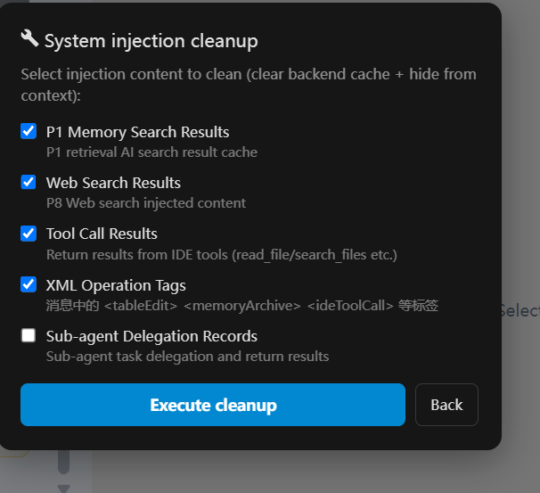

</details>

<details>
<summary><strong>🔬 自律駆動 P1 — 現在改良中のゼロ LLM 検索エンジン</strong></summary>

AI P1 は毎ターン API リクエストを送る必要があります——遅延があり、コストがかかり、オフラインでは使えません。そこで完全な純アルゴリズムパイプライン（21 ノード、約 9,000 行）を書き上げました。目標はミリ秒級、ネットワーク不要、文単位のアテンションです。

**データ基盤**：[SWOW 中国語連想ネットワーク](https://smallworldofwords.org/) / [ConceptNet Numberbatch 300次元単語ベクトル](https://github.com/commonsense/conceptnet-numberbatch)（約30万語）/ ConceptNet 中国語関係グラフ / THUOCL など複数のソース辞書。語彙は AI によるネット検索 + 2日間の自己審査で取得しており、構築コストはほぼゼロです。

**パイプライン**：分かち書き → SWOW 連想発散（同義語拡散は禁止——実測で有効にすると品質が 55〜76% 低下する）→ 6軸並列スコアリング（心理/情報/社会/論理/言語/認知）→ 47 のサブ方向の位置特定 → 複数リソースの相互確認 → 空間投票ランキング（加算 IDW、乗算ではない）→ 二次発散（5本の独立経路）→ BLQ スコアリング（CombSUM の加算融合を参照、独自研究の次元重み）→ 方向語の選択 → コンテキストへの注入。21 ノードすべてが純アルゴリズムで、LLM はゼロです。

**実験**：27 バージョンの反復、発散スコアは v9→v26 で 2.01 から 4.05 まで向上（+101%、満点5、人手による単語ごとの判定）；再現率 約90%；総合平均 約3.5点。無難で当たり障りのない回答の比率は 74% から 4% に低下。

**実際の出力**（200例のバッチ実行の生ログ）：

| ユーザー入力 | システムの発散方向 | 越境した学問分野 |
| --- | --- | --- |
| 「もう限界かもしれない、生きるってどうしてこんなに難しいの？」 | 今この瞬間の気づき / 内受容感覚 / **実在の本質とは何か** | 心理学 → **実存主義哲学** |
| 「ユニコーン企業の面接に備えている、深みのある質問をどう用意すればいい？」 | 根本原因分析 / **最近接発達領域** | 経営学 → **教育心理学** |
| 「限られた予算で自社トラフィックの運用をして離脱ユーザーを取り戻す」 | **デフォルトモードネットワークの活性化** / **BDNF（脳由来神経栄養因子）** | マーケティング → **認知神経科学** |
| 「データベースクエリがとても遅いのをどう最適化する？」 | 不変性と状態更新 / **単一責任原則（SRP）** | 運用 → **ソフトウェア工学の方法論** |
| 「剣士が雪山で敵に遭遇する物語」 | **チェーホフの銃** / ユング的元型 | 物語 → **物語論 + 分析心理学** |
| ユーザーの自作詩「光が来る前に私は死んだ」 | **可能世界と並行宇宙** | 詩 → **物理学の多世界解釈** |

語彙採用基準：**メインモデルが素で読むだけで思いつける単語は無駄な単語**——P1 の価値は、モデルが自力では思いつかない方向を与えることにあります。

</details>

<details>
<summary><strong>👑 プロンプトエンジン + 世界観設定の動的注入</strong></summary>

**TweakPrompt の3ラウンド**が全モジュールの出力を統一的に引き継ぎます：Round 1 で収集 → Round 2 で5段構成のメッセージ構造（beforeChat / injectionAbove / chatHistory / injectionBelow / afterChat）を再構築+マクロ置換 → Round 3 でスナップショット。

**世界観設定の3つの発動モード**：常時（毎ターン注入）/ 正規表現（キーワードでトリガー）/ 動的（記憶テーブルの数値条件を読み取ってトリガー——好感度が80を超えると特別な会話が解放される、タスク進行度が第3章に達すると世界観の描写が切り替わる、など）。

**マクロシステム**：`{{char}}` / `{{user}}` / `{{tableData}}` / `{{hotMemory}}` / `{{current_date}}` / `{{time}}` / `{{idle_duration}}` + カスタムマクロ。

</details>

<details>
<summary><strong>🏗️ システムアーキテクチャ</strong></summary>

3層構成：**機能層**（記憶/圧縮/検索/プリセット/世界観設定/ネット接続/ファイル操作……グローバルに1つ）→ **伝導層**（各ウィンドウがそれぞれ独自に接続し、id で隔離、非同期でお互いを妨げない）→ **インターフェース層**（Web/Bot/デスクトップペット/VSCode 拡張、インターフェースを変えても能力は変わらない）。

データ隔離：ユーザーレベル（AI ソース/グローバル設定）/ キャラクターカードレベル（記憶/対話/世界観設定/正規表現）/ 対話レベル（チャット履歴/モード/サブモード）。

22 個のプラグインは統一規格に沿って成長し、MCP が外部ツールを接続、ユーザーレベルのプラグインホストが Python/Node プログラムをマウントします——拡張は本体コードを変更しません。

</details>

<details>
<summary><strong>🔭 巨大コンテキストウィンドウ時代について</strong></summary>

たとえウィンドウが 10M+ トークンまで拡張されても、私たちは階層記憶を維持し続けます：①コンテキスト長が伸びるほど利用効率が低下することは実験的に十分裏付けられている；②約 10K トークンの厳選された記憶で 100K+ トークン分の履歴情報量を担える、コストは一桁違う；③構造化テーブルは散らばった対話よりも AI が正確に読み書きしやすい。

</details>

---

## ロードマップ

**完了済み**：3層記憶 · 圧縮システム · P1 検索 · プロンプトエンジン · プリセット自動切り替え · 記憶テーブル · 世界観設定の動的注入 · Live2D デスクトップペット · ゲーム同伴 · 音声入力 · AI によるスライド作成 · MCP · マルチウィンドウ並行 · VSCode 拡張ブリッジ · Discord Bot · 22 プラグイン · ごみ箱とバックアップ復元 · フルスタック診断 · 多言語対応

**近い将来の計画**：自律駆動 P1（純アルゴリズム、LLM ゼロ、文単位のアテンション）· より多くの Bot プラットフォーム · プラグインエコシステム · TTS / 画像生成 · AI ゲームエンジン（era 系の血統、数値の確定的なコード+LLM ナラティブ+シンボリックレンダリング）· ライブ配信モード

---

## 技術スタック

ランタイム fount（Deno）· バックエンド Node.js 互換レイヤー + Express ルーティング · フロントエンド バニラ JS（ESM）· スマート検索 BM25+正規表現（純 JS、依存関係ゼロ）· デスクトップペット Electron · 音声ローカル文字起こしモデル · クロスプラットフォーム discord.js v14 · ストレージは純粋な JSON

---

## コミュニティ

<a href="https://discord.gg/agHeDq9bqU"></a>

キャラクターカードの共有 · プリセットの公開 · 世界観設定への貢献 · バグ報告 · 提案 · コード貢献 — 参加をお待ちしています！

---

## 使用している技術とリソース

- **音声文字起こし**：[MOSS-Transcribe-Diarize](https://huggingface.co/ICTNLP/MOSS-Transcribe-Diarize)（ローカルデプロイ、話者分離対応、モデルは約1.8GBで初回使用時に自動ダウンロード）
- **単語ベクトル**：[ConceptNet Numberbatch](https://github.com/commonsense/conceptnet-numberbatch)（Speer & Lowry-Duda, 2017）
- **連想データ**：[SWOW（Small World of Words）](https://smallworldofwords.org/) 中国語連想データセット
- **分かち書きと辞書**：THUOCL / CoreNatureDictionary / Chinese-Synonyms などの公開リソース
- **検索エンジンブリッジ**：[ddgs](https://pypi.org/project/ddgs/)（Python の TLS フィンガープリント層。素の fetch が検索エンジンに格下げされる問題を解決）

## 謝辞

- **[fount](https://github.com/steve02081504/fount)** — プロジェクト初期の基盤フレームワークとして、AI メッセージの送受信・サービスソース管理・モジュールロードなど、コア基盤の初期参考実装を提供してくれました。現在はアーキテクチャ的に完全に独自進化していますが、fount は初期の低レベル開発時間を大きく節約し、貴重なアイデアの参考を数多く与えてくれたことに、心より感謝します
- **[SillyTavern](https://github.com/SillyTavern/SillyTavern)** — AI ロールプレイ分野の先駆的プロジェクト。そのプリセット形式・キャラクターカード規格・世界観設定システムはコミュニティの標準となっており、本プロジェクトはそのエコシステムに完全互換です
- **SillyTavern プラグインコミュニティ** — レンダリングエンジンや機能拡張などにおける探求と共有をしてくれた、すべてのオープンソースプラグイン作者に感謝します

---

<details>
<summary><strong>📸 その他の機能スクリーンショット（クリックして展開）</strong></summary>

| | | |
|---|---|---|
| 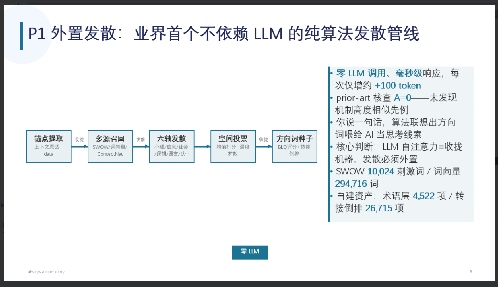 **PPT 全プロセス** | 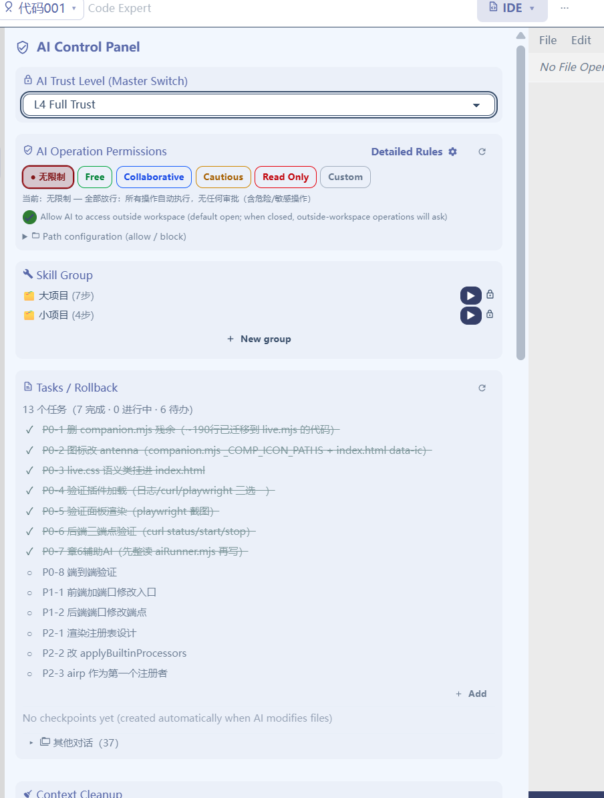 **セキュリティとタスクフロー** | 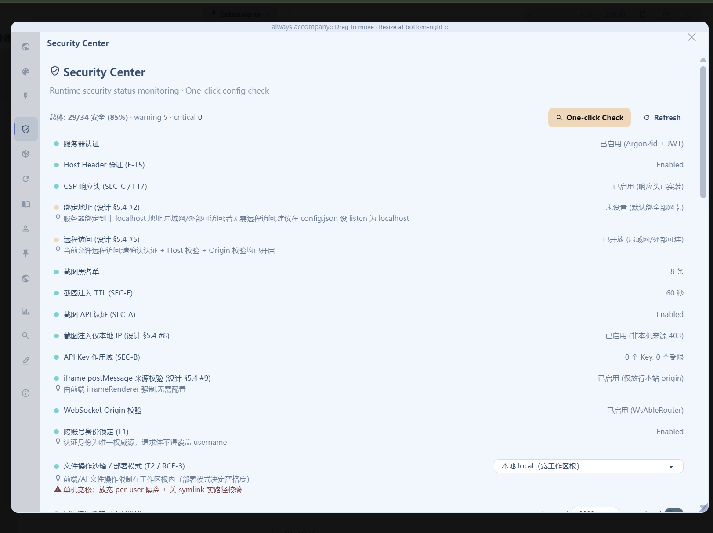 **セキュリティ防護センター** |
| 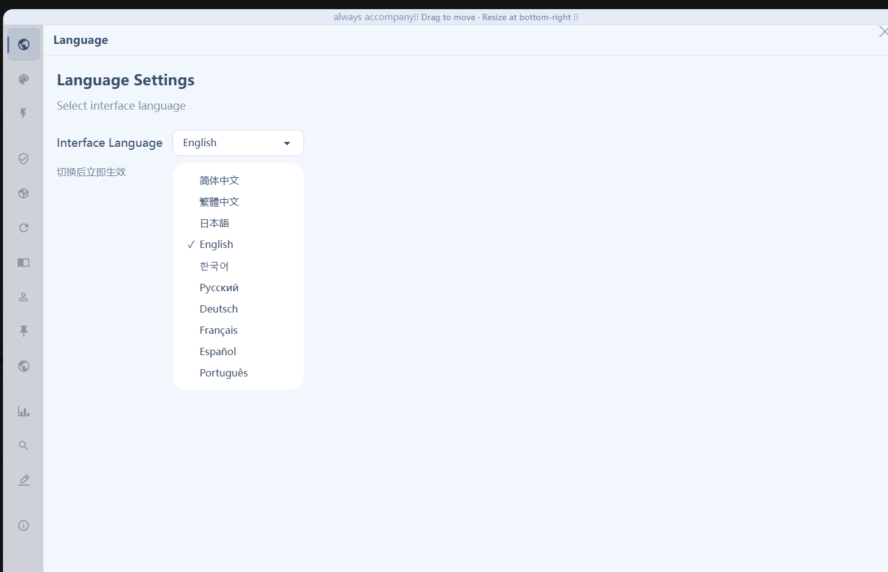 **多言語対応** | 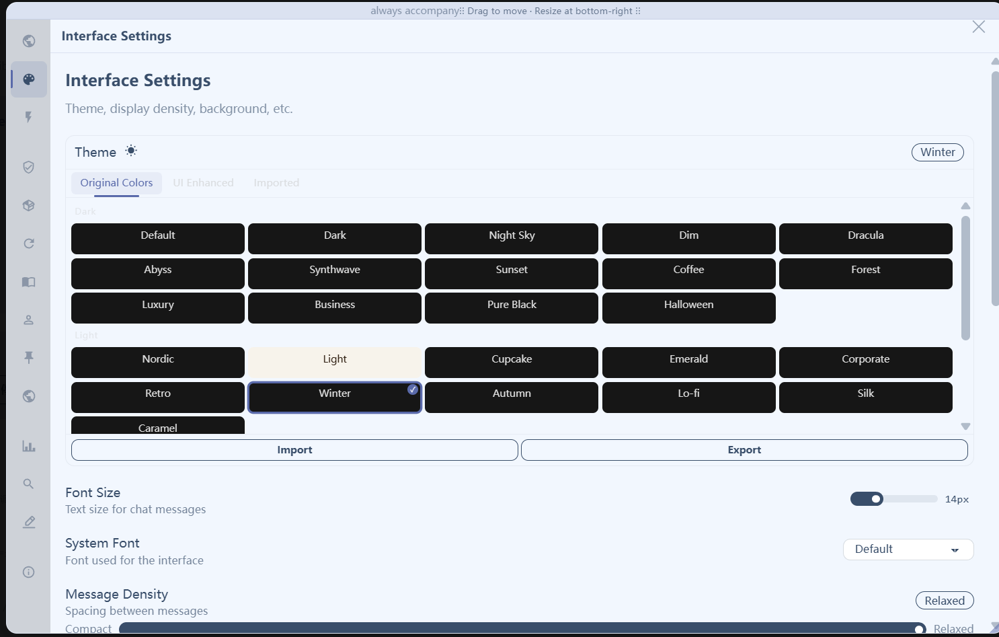 **複数テーマ** | 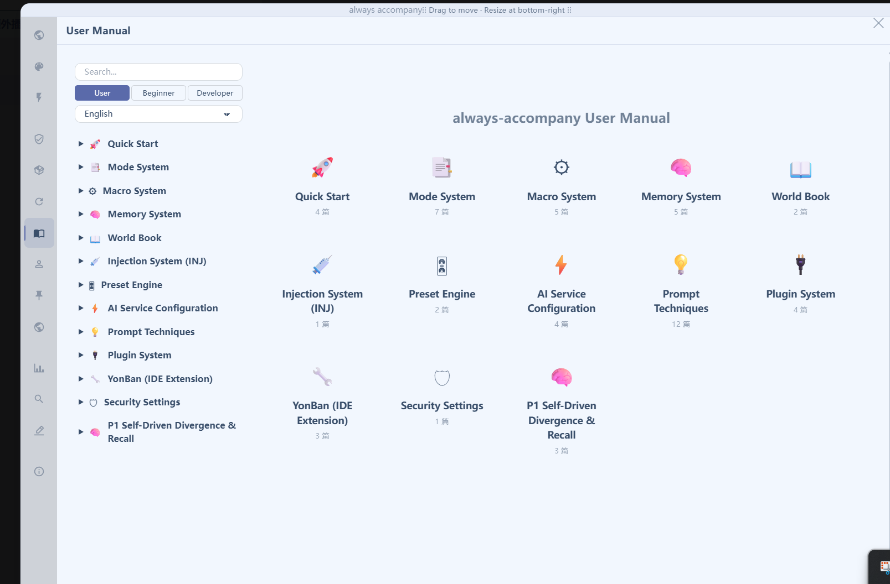 **内蔵 Wiki** |
| 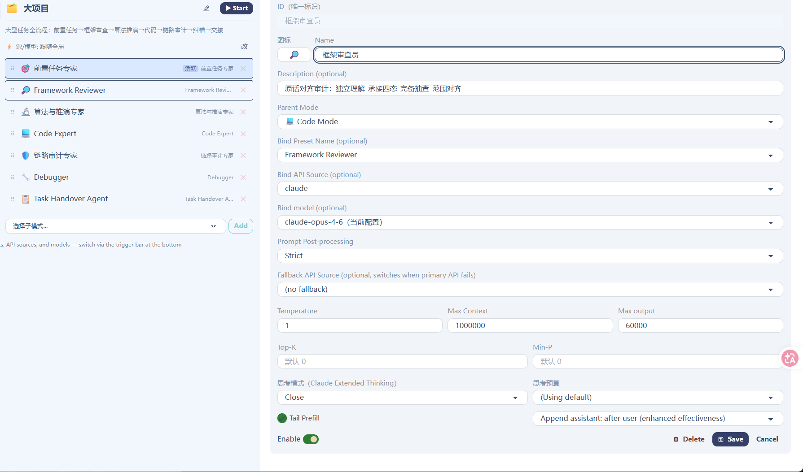 **サブモードワークフロー** |  **コンテキスト一覧** | 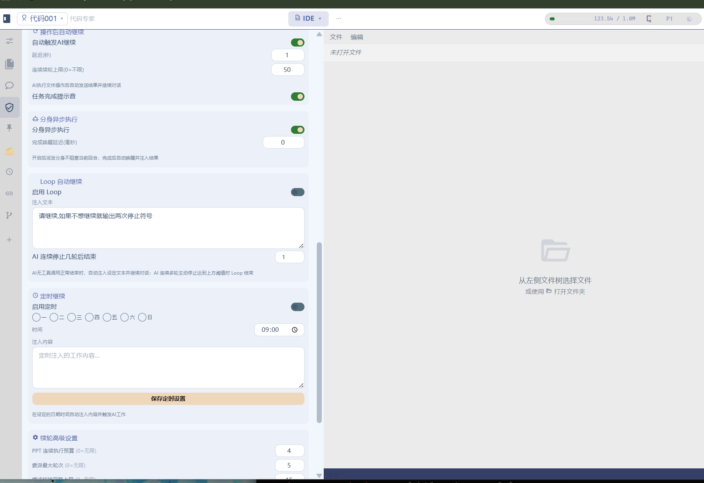 **自動/定時 Loop** |
| 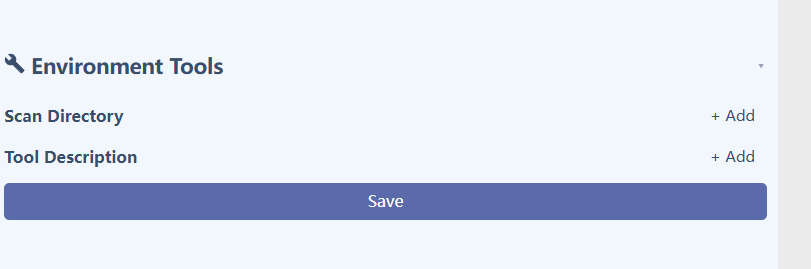 **環境検出** | 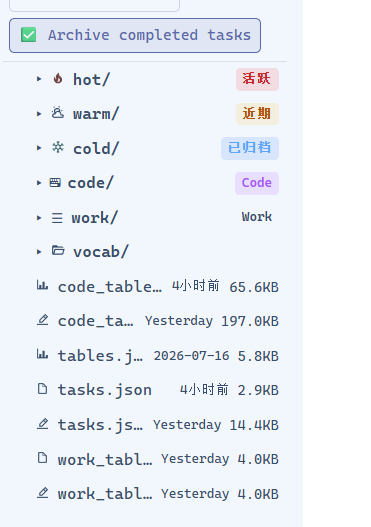 **記憶ファイル構造** | 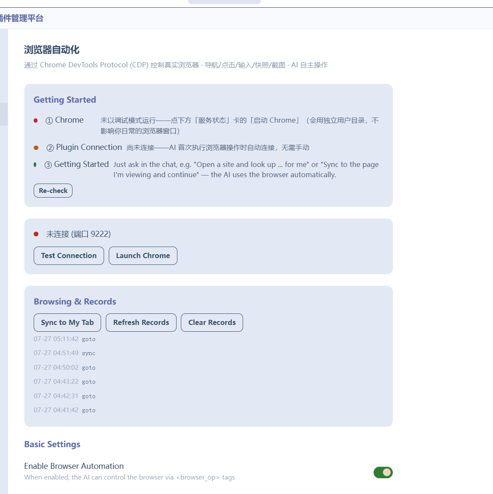 **ブラウザ自動化** |
| 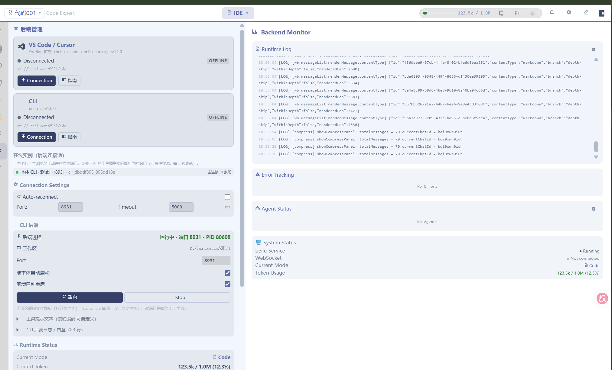 **外部インターフェース** |  **Discord Bot** | |

</details>
